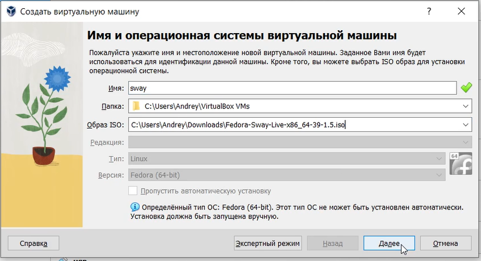
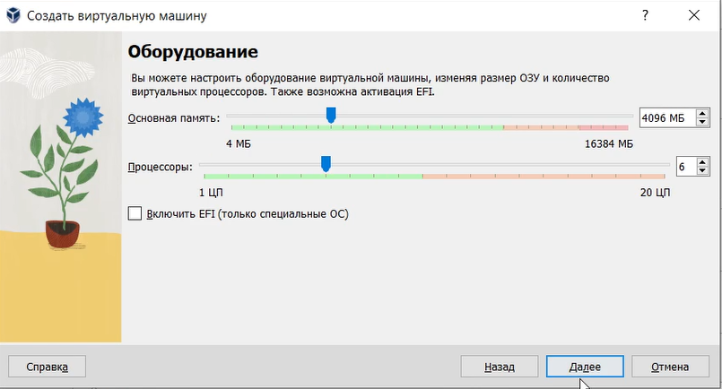
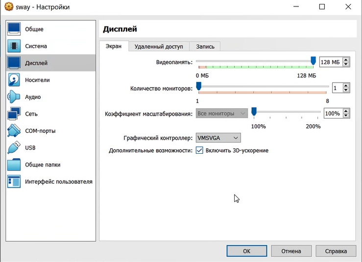
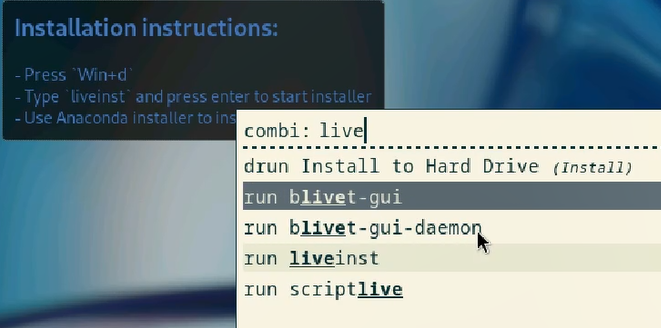
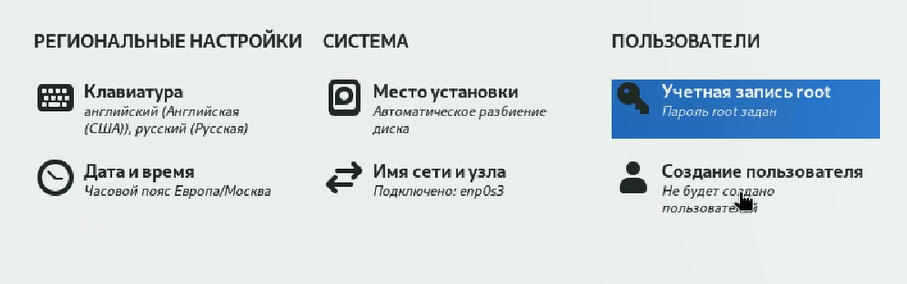
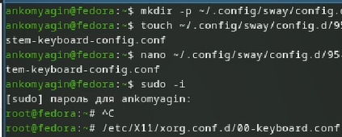
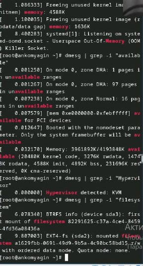
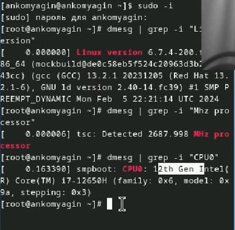

---
## Front matter
title: "Лабораторная работа №1"
subtitle: "Установка ОС Linux"
author: "Комягин Андрей Николаевич"

## Generic otions
lang: ru-RU
toc-title: "Содержание"

## Bibliography
bibliography: bib/cite.bib
csl: pandoc/csl/gost-r-7-0-5-2008-numeric.csl

## Pdf output format
toc: true # Table of contents
toc-depth: 2
lof: true # List of figures
lot: true # List of tables
fontsize: 12pt
linestretch: 1.5
papersize: a4
documentclass: scrreprt
## I18n polyglossia
polyglossia-lang:
  name: russian
  options:
	- spelling=modern
	- babelshorthands=true
polyglossia-otherlangs:
  name: english
## I18n babel
babel-lang: russian
babel-otherlangs: english
## Fonts
mainfont: PT Serif
romanfont: PT Serif
sansfont: PT Sans
monofont: PT Mono
mainfontoptions: Ligatures=TeX
romanfontoptions: Ligatures=TeX
sansfontoptions: Ligatures=TeX,Scale=MatchLowercase
monofontoptions: Scale=MatchLowercase,Scale=0.9
## Biblatex
biblatex: true
biblio-style: "gost-numeric"
biblatexoptions:
  - parentracker=true
  - backend=biber
  - hyperref=auto
  - language=auto
  - autolang=other*
  - citestyle=gost-numeric
## Pandoc-crossref LaTeX customization
figureTitle: "Рис."
tableTitle: "Таблица"
listingTitle: "Листинг"
lofTitle: "Список иллюстраций"
lotTitle: "Список таблиц"
lolTitle: "Листинги"
## Misc options
indent: true
header-includes:
  - \usepackage{indentfirst}
  - \usepackage{float} # keep figures where there are in the text
  - \floatplacement{figure}{H} # keep figures where there are in the text
---

# Цель работы

Преобретение практических навыков установки операционной системы на виртуальную машину, настройки минимально необходимых для работы сервисов

# Задание

* Создать виртуальную машину Linux
* Установить необходимые программы/драйвера
* Настроить раскладку клавиатуры
* Установить ПО для создания документации

# Выполнение лабораторной работы

Укажем имя машины и iso образ.(рис. [-@fig:001]).

{#fig:001 width=70%}

Выделим машине процессоры и память (рис. [-@fig:002]).

{#fig:002 width=70%}

Изменим параметры дисплея (рис. [-@fig:003]).

{#fig:003 width=70%}

Запустим установщик ОС с помощью liveinst (рис. [-@fig:004]).

{#fig:004 width=70%}

Укажем необходимые параметры и установим ОС (рис. [-@fig:005]).

{#fig:005 width=70%}

Далее необходимо установить и обновить множество программ. Это

* dnf
* tmux mc
* dnf-automatic
* "Development Tools"
* dkms
* texlive-scheme-full
* git

Также очень важно настроить раскладку клавиатуры. Выполним последовательность команд (рис. [-@fig:006]) 

{#fig:006 width=70%}

Необходимо получить некоторую информацию о системе, она изображена на скринах  (рис. [-@fig:007]) рис. [-@fig:008]).

{#fig:007 width=70%}

{#fig:008 width=70%}

# Выводы

В ходе выполнения лабораторной работы я создал виртуальную машину и научился её настраивать для последующей комфортной.

# Список литературы{.unnumbered}

[Туис, курс Архитектура компьютера и операционные системы](https://esystem.rudn.ru/course/view.php?id=5790)
