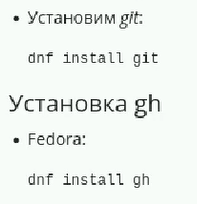
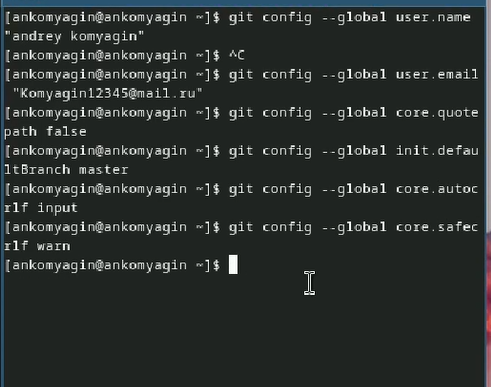
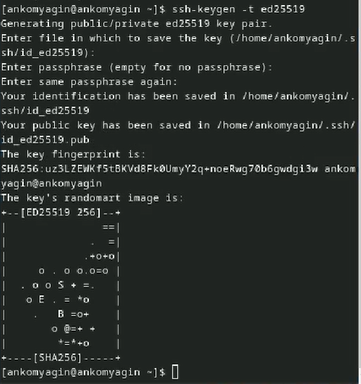
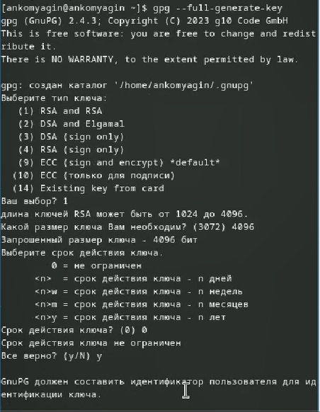
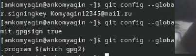
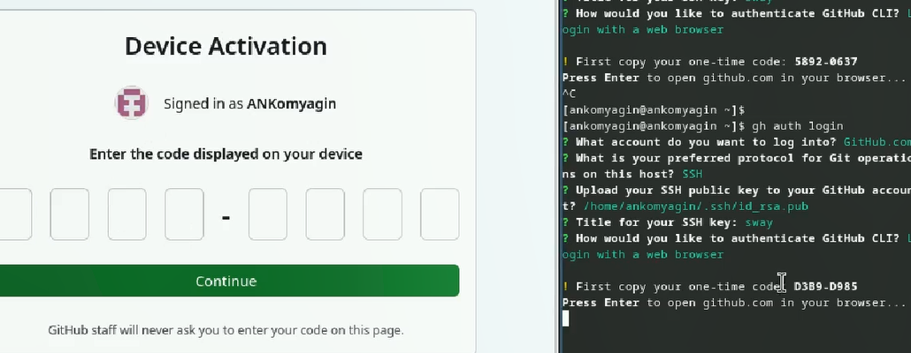
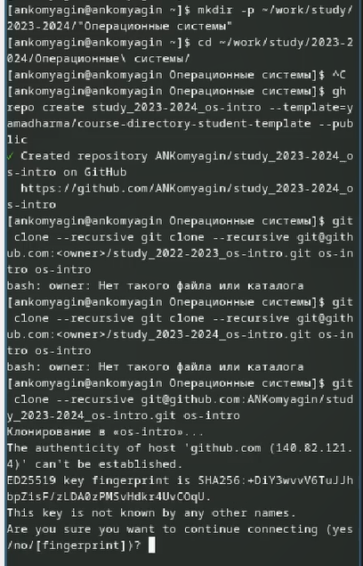
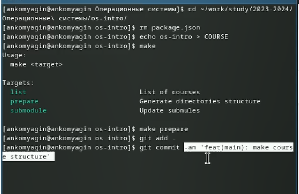

---
## Front matter
lang: ru-RU
title: Лабораторная работа №2
subtitle: Первоначальная настройка git
author:
  - Комягин А.Н.
institute:
  - Российский университет дружбы народов, Москва, Россия
date: 1 марта 2024

## i18n babel
babel-lang: russian
babel-otherlangs: english

## Formatting pdf
toc: false
toc-title: Содержание
slide_level: 2
aspectratio: 169
section-titles: true
theme: metropolis
header-includes:
 - \metroset{progressbar=frametitle,sectionpage=progressbar,numbering=fraction}
 - '\makeatletter'
 - '\beamer@ignorenonframefalse'
 - '\makeatother'

##Fonts
mainfont: PT Serif
romanfont: PT Serif
sansfont: PT Sans
monofont: PT Mono
mainfontoptions: Ligatures=TeX
romanfontoptions: Ligatures=TeX
sansfontoptions: Ligatures=TeX,Scale=MatchLowercase
monofontoptions: Scale=MatchLowercase,Scale=0.9
---

## Цель

Изучить концепцию и применение средств контроля версий. Приобрести навыки работы с git.

## Задание

* Создать базовую конфигурацию для работы с git
* Создать ключ SSH
* Создать ключ PGP
* Настроить подписи git
* Зарегистрироваться на Github
* Создать локальный каталог для выполнения заданий по предмету

# Выполнение лабораторной работы

## Установка необходимого ПО

{width=90%}

## Настроим git

{width=95%}

## Создадим ключи ssh 

{width=43%} 
{width=45%}

## Создадим ключ gpg

{width=95%}

## Добавим ключ на Github

{width=95%}

## Настройка gh

{width=95%}

## Создание репозитория

{width=95%}

## Настройка каталога и отправка на git

{width=95%}

# Контрольные вопросы

## 1. Что такое системы контроля версий (VCS) и для решения каких задач они предназначаются? 

Системы контроля версий (VCS) - это инструменты, которые помогают отслеживать изменения в исходном коде и управлять ими. Они предназначены для решения задач хранения истории изменений, совместной работы над проектами, отката к предыдущим версиям и т. д.

## 2. Объясните понятия VCS

  * Хранилище (repository) - это место, где хранится история изменений проекта.
  
  * Commit - это операция сохранения изменений в репозитории.
  
  * История (history) - это список всех коммитов, которые были сделаны в проекте.
  
  * Рабочая копия (working copy) - это каталог на компьютере разработчика, в котором он работает над проектом.
  
## 3. Что представляют собой и чем отличаются централизованные и децентрализованные VCS?

Централизованные VCS имеют единственный центральный сервер, к которому подключаются все разработчики (например, SVN). Децентрализованные VCS позволяют каждому разработчику иметь полную копию репозитория, с которой он может работать независимо (например, Git).

## 4. Опишите действия с VCS при единоличной работе с хранилищем.

При единоличной работе с хранилищем в VCS разработчик делает изменения в своей рабочей копии проекта, коммитит их в локальный репозиторий и при необходимости откатывается к предыдущим версиям.

## 5. Опишите порядок работы с общим хранилищем VCS.

Порядок работы с общим хранилищем VCS включает получение изменений из удаленного репозитория, коммит изменений в локальный репозиторий и отправку изменений обратно в удаленный репозиторий.

## 6. Каковы основные задачи, решаемые инструментальным средством git? 

Git предназначен для управления версиями файлов, совместной работы над проектами, отслеживания изменений и управления различными ветками разработки.

## 7. Назовите и дайте краткую характеристику командам git.

  * git add <файл> - добавление файла в индекс (обычно точка).
  
  * git commit -m "Сообщение" - создание коммита с описанием изменений.
  
  * git push - отправка изменений в удаленный репозиторий.
  
  * git pull - получение изменений из удаленного репозитория.
  
## 8.  Приведите примеры использования при работе с локальным и удалённым репозиториями.

 При работе с локальным репозиторием можно использовать команды git add, git commit. 
 
 При работе с удаленным репозиторием - git clone, git push, git pull.
 
## 9.  Что такое и зачем могут быть нужны ветви (branches)?

 Ветви (branches) в Git позволяют разрабатывать различные функциональности независимо друг от друга, а затем объединять изменения.
 
## 10.   Как и можно игнорировать некоторые файлы при commit?

 Для игнорирования некоторых файлов при коммите можно использовать файл .gitignore, в который записываются шаблоны файлов или папок, которые не должны попадать в репозиторий.

## Вывод

В ходе выполнения лабораторной работы я повторил правила работы с git, узнал о системе подписей и pgp ключах.

