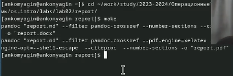
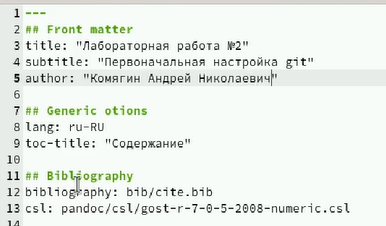
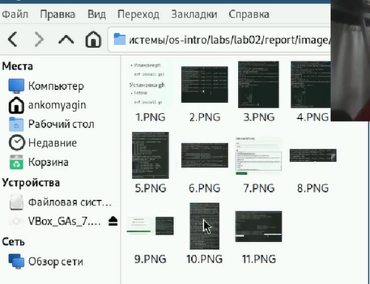
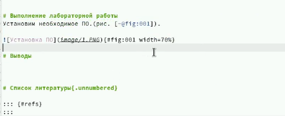
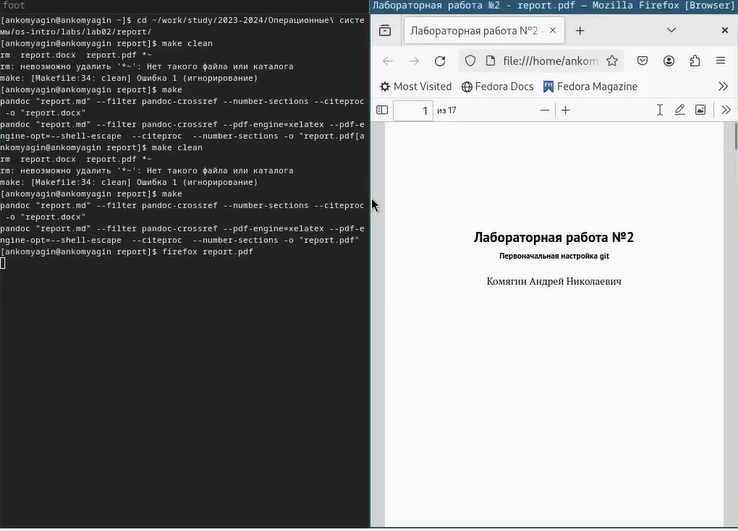

---
## Front matter
title: "Лабораторная работа №3"
subtitle: "Markdown"
author: "Комягин Андрей Николаевич"

## Generic otions
lang: ru-RU
toc-title: "Содержание"

## Bibliography
bibliography: bib/cite.bib
csl: pandoc/csl/gost-r-7-0-5-2008-numeric.csl

## Pdf output format
toc: true # Table of contents
toc-depth: 2
lof: true # List of figures
lot: true # List of tables
fontsize: 12pt
linestretch: 1.5
papersize: a4
documentclass: scrreprt
## I18n polyglossia
polyglossia-lang:
  name: russian
  options:
	- spelling=modern
	- babelshorthands=true
polyglossia-otherlangs:
  name: english
## I18n babel
babel-lang: russian
babel-otherlangs: english
## Fonts
mainfont: PT Serif
romanfont: PT Serif
sansfont: PT Sans
monofont: PT Mono
mainfontoptions: Ligatures=TeX
romanfontoptions: Ligatures=TeX
sansfontoptions: Ligatures=TeX,Scale=MatchLowercase
monofontoptions: Scale=MatchLowercase,Scale=0.9
## Biblatex
biblatex: true
biblio-style: "gost-numeric"
biblatexoptions:
  - parentracker=true
  - backend=biber
  - hyperref=auto
  - language=auto
  - autolang=other*
  - citestyle=gost-numeric
## Pandoc-crossref LaTeX customization
figureTitle: "Рис."
tableTitle: "Таблица"
listingTitle: "Листинг"
lofTitle: "Список иллюстраций"
lotTitle: "Список таблиц"
lolTitle: "Листинги"
## Misc options
indent: true
header-includes:
  - \usepackage{indentfirst}
  - \usepackage{float} # keep figures where there are in the text
  - \floatplacement{figure}{H} # keep figures where there are in the text
---

# Цель работы

Научиться оформлять отчёты с помощью языка Markdown, сделать пару десятков отчётов.

# Задание

* Сделайте отчёт по предыдущей лабораторной работе в формате Markdown
* В качестве отчёта просьба предоставить отчёты в 3 форматах: pdf, docx и md (в архиве,
поскольку он должен содержать скриншоты, Makefile и т.д.)

# Выполнение лабораторной работы

Зайдём в каталог с файлом report.md, проверим работу make файла.(рис. [-@fig:001]).

{#fig:001 width=70%}

С помощью редактора gedit откроем файл report.md и тщательно ознакомимся с его содержимым. Начнём заполнять отчёт под себя (рис. [-@fig:002]).

{#fig:002 width=70%}

Далее необходимо перенести изображение для отчёта в папку image (рис. [-@fig:003]) 

{#fig:003 width=70%}

Добавим пояснение и первое изображение (рис. [-@fig:004]).
{#fig:004 width=70%}

Повторяем предыдущие шаги n раз.

Когда редактирование файла report.md окончено, соберём его командой make и посмотрим получившийся pdf файл (рис. [-@fig:005]).

{#fig:005 width=70%}

Остаётся только добавить файлы на Github
* git add .
* git commit -am '...'
* git push
 
# Выводы

В ходе выполнения лабораторной работы я научился создавать отчёты при помощи легковесного языка Markdown.

# Список литературы{.unnumbered}

[Туис, курс Архитектура компьютера и операционные системы](https://esystem.rudn.ru/course/view.php?id=5790)
