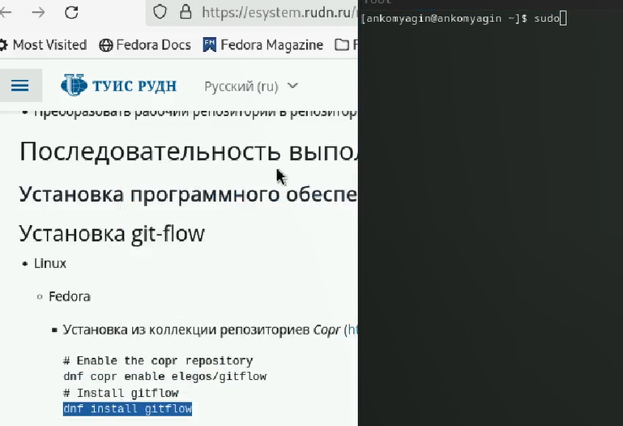
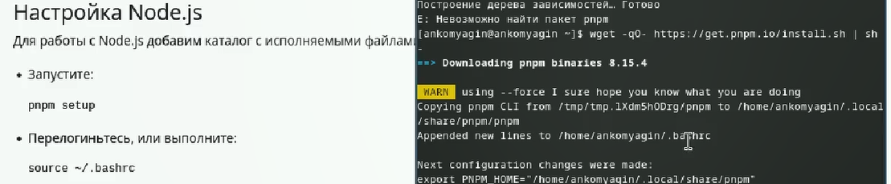
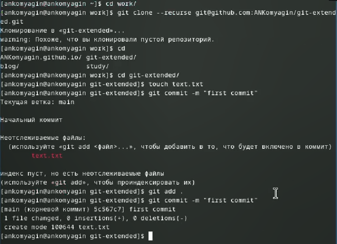
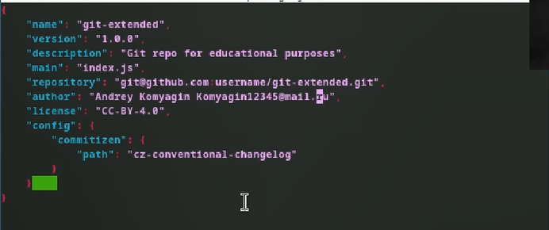
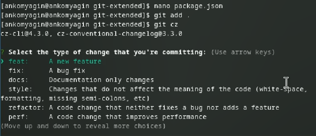
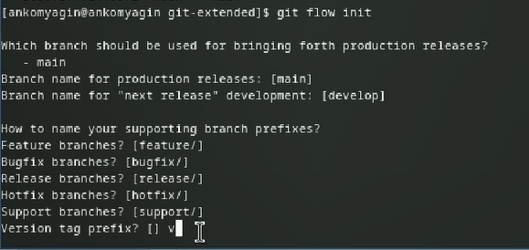
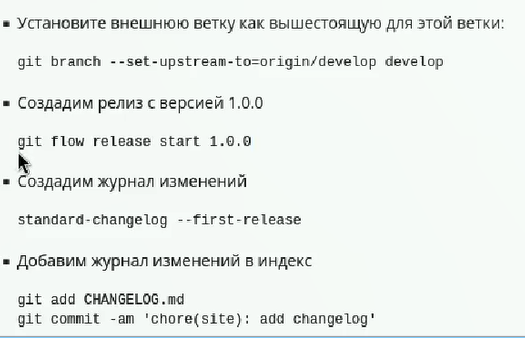
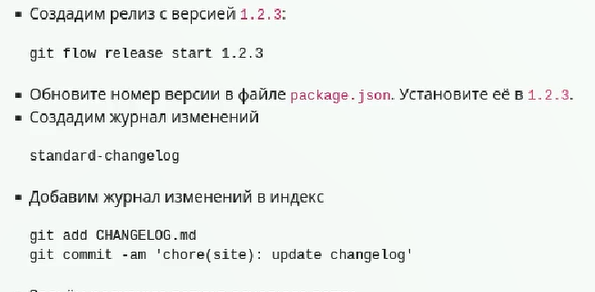
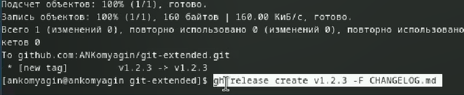

---
## Front matter
lang: ru-RU
title: Лабораторная работа №4
subtitle: Продвинутое использование git
author:
  - Комягин А.Н.
institute:
  - Российский университет дружбы народов, Москва, Россия
date: 9 марта 2024

## i18n babel
babel-lang: russian
babel-otherlangs: english

## Formatting pdf
toc: false
toc-title: Содержание
slide_level: 2
aspectratio: 169
section-titles: true
theme: metropolis
header-includes:
 - \metroset{progressbar=frametitle,sectionpage=progressbar,numbering=fraction}
 - '\makeatletter'
 - '\beamer@ignorenonframefalse'
 - '\makeatother'

##Fonts
mainfont: PT Serif
romanfont: PT Serif
sansfont: PT Sans
monofont: PT Mono
mainfontoptions: Ligatures=TeX
romanfontoptions: Ligatures=TeX
sansfontoptions: Ligatures=TeX,Scale=MatchLowercase
monofontoptions: Scale=MatchLowercase,Scale=0.9
---

## Цель

Получение навыков продвинутой работы с репозиториями git.

## Задание

* Выполнить работу для тестового репозитория.

* Преобразовать рабочий репозиторий в репозиторий с git-flow и conventional commits.

# Выполнение лабораторной работы

## Установка необходимого ПО

{width=90%}

## Установка ПО

{width=95%}

## Создание репозитория

{width=90%} 

## Создание репозитория

{width=90%}

## Изменяем параметры пакета

{width=95%}

## коммит cz

{width=95%}

## Инициализация git-flow

{width=95%}

## операция над веткой

{width=95%}

## релиз 1.2.3

{width=95%}

## создадим релиз изменений

{width=95%}

## Вывод

В ходе выполнения лабораторной работы я получил навыки правильной работы с репозиториями git.

