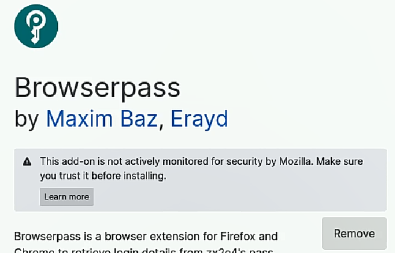

---
## Front matter
lang: ru-RU
title: Лабораторная работа №5
subtitle: Настройка рабочей среды
author:
  - Комягин А.Н.
institute:
  - Российский университет дружбы народов, Москва, Россия
date: 16 марта 2024

## i18n babel
babel-lang: russian
babel-otherlangs: english

## Formatting pdf
toc: false
toc-title: Содержание
slide_level: 2
aspectratio: 169
section-titles: true
theme: metropolis
header-includes:
 - \metroset{progressbar=frametitle,sectionpage=progressbar,numbering=fraction}
 - '\makeatletter'
 - '\beamer@ignorenonframefalse'
 - '\makeatother'

##Fonts
mainfont: PT Serif
romanfont: PT Serif
sansfont: PT Sans
monofont: PT Mono
mainfontoptions: Ligatures=TeX
romanfontoptions: Ligatures=TeX
sansfontoptions: Ligatures=TeX,Scale=MatchLowercase
monofontoptions: Scale=MatchLowercase,Scale=0.9
---

## Цель

Настроить менеджер паролей pass, научиться с ним работать

# Выполнение лабораторной работы

## Установка необходимого ПО

{width=90%}

## инициализация хранилища

{width=95%}

## создаем репозиторий и адрес репозитория

!(./image/3.PNG){width=95%} 

## Синхронизируемся с репозиторием

{width=95%}

## Установим browserpass

{width=95%}

## Установим плагин

{width=95%}

## Работа с паролями

{width=95%}

## Установка дополнительного ПО

{width=95%}

## Создание репозитория

{width=95%}

## Инициализируем chezmoi

{width=95%}

## chezmoi на другой машине

{width=95%}

## автоматическая фиксация изменений в репозитории

{width=95%}

## Вывод

В ходе выполнения лабораторной работы я получил навыки работы с менеджером паролей pass.

