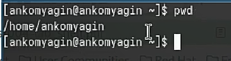

---
## Front matter
title: "Лабораторная работа №6"
subtitle: "Основы интерфейса взаимодействия пользователя с системой Unix на уровне командной строки"
author: "Комягин Андрей Николаевич"

## Generic otions
lang: ru-RU
toc-title: "Содержание"

## Bibliography
bibliography: bib/cite.bib
csl: pandoc/csl/gost-r-7-0-5-2008-numeric.csl

## Pdf output format
toc: true # Table of contents
toc-depth: 2
lof: true # List of figures
lot: true # List of tables
fontsize: 12pt
linestretch: 1.5
papersize: a4
documentclass: scrreprt
## I18n polyglossia
polyglossia-lang:
  name: russian
  options:
	- spelling=modern
	- babelshorthands=true
polyglossia-otherlangs:
  name: english
## I18n babel
babel-lang: russian
babel-otherlangs: english
## Fonts
mainfont: PT Serif
romanfont: PT Serif
sansfont: PT Sans
monofont: PT Mono
mainfontoptions: Ligatures=TeX
romanfontoptions: Ligatures=TeX
sansfontoptions: Ligatures=TeX,Scale=MatchLowercase
monofontoptions: Scale=MatchLowercase,Scale=0.9
## Biblatex
biblatex: true
biblio-style: "gost-numeric"
biblatexoptions:
  - parentracker=true
  - backend=biber
  - hyperref=auto
  - language=auto
  - autolang=other*
  - citestyle=gost-numeric
## Pandoc-crossref LaTeX customization
figureTitle: "Рис."
tableTitle: "Таблица"
listingTitle: "Листинг"
lofTitle: "Список иллюстраций"
lotTitle: "Список таблиц"
lolTitle: "Листинги"
## Misc options
indent: true
header-includes:
  - \usepackage{indentfirst}
  - \usepackage{float} # keep figures where there are in the text
  - \floatplacement{figure}{H} # keep figures where there are in the text
---

# Цель работы

Приобрести практические навыки взаимодействия с системой посредством командной строки.

# Выполнение лабораторной работы

Определим имя домашнего каталога.(рис. [-@fig:001]).

{#fig:001 width=70%}

Перейдём в tmp, выведем на экран содержимое tmp (рис. [-@fig:002]).

{#fig:002 width=70%}

Содержимое каталога tmp с ключом -a (рис. [-@fig:003])  

{#fig:003 width=70%}

Содержимое каталога tmp с ключом -R рис. [-@fig:004]).

{#fig:004 width=70%}

Выведем содержимое каталога /var/spoon и посмотрим, есть ли там подкаталог cron (рис. [-@fig:005]).

{#fig:005 width=70%}

Cоздадим новый каталог с именем newdir (рис. [-@fig:006]) 

{#fig:006 width=70%}

Создадим и удалим подкаталог newdir/morefun (рис. [-@fig:007]) 

{#fig:007 width=70%}

Создадим три новых каталога одной командой (рис. [-@fig:008])

{#fig:008 width=70%}

Удалим эти каталоги одной командой (рис. [-@fig:009])

{#fig:009 width=70%}

Далее будем работать с командой man. С её помощью узнаем всё о командах, которые использовали ранее (рис. [-@fig:010])

{#fig:010 width=70%}

# Контрольные вопросы

1. Что такое командная строка?

Командная строка (или терминал) - это интерфейс взаимодействия пользователя с операционной системой Linux, где пользователь может вводить команды для выполнения различных операций.

2. При помощи какой команды можно определить абсолютный путь текущего каталога? Приведите пример.

Для определения абсолютного пути текущего каталога используется команда "pwd". Например, если вы находитесь в каталоге /home/ankomyagin, то после ввода команды "pwd" будет выведен абсолютный путь /home/ankomyagin.

3. При помощи какой команды и каких опций можно определить только тип файлов

Для определения только типов файлов и их имен в текущем каталоге можно использовать команду "ls -F". Например, "ls -F" покажет все файлы и каталоги в текущем каталоге с указанием их типов (например, "/" для каталогов).

4. Каким образом отобразить информацию о скрытых файлах? Приведите примеры.

Чтобы отобразить информацию о скрытых файлах, нужно использовать опцию "-a" с командой ls. Например, "ls -a" отобразит все файлы, включая скрытые, начинающиеся с точки.

5. При помощи каких команд можно удалить файл и каталог?Можно ли это сделать одной и той же командой? Приведите примеры.

Для удаления файла используется команда "rm", а для удаления каталога - команда "rm -r". Нельзя удалить файл и каталог одной и той же командой. Пример удаления файла: "rm file.txt", пример удаления каталога: "rm -r directory".

6. Каким образом можно вывести информацию о последних выполненных пользователем командах? работы?

Для вывода информации о последних выполненных командах пользователем используется команда "history".

7. Как воспользоваться историей команд для их модифицированного выполнения? Приведите примеры.

Для модификации выполнения команд из истории можно использовать клавиши со стрелками (например, стрелка вверх для перехода к предыдущей команде) или команду "!n", где n - номер команды в истории.

8. Приведите примеры запуска нескольких команд в одной строке.

Пример запуска нескольких команд в одной строке: "command1 ; command2".

9. Дайте определение и приведите примера символов экранирования.

Символ экранирования "используется для обозначения специальных символов, чтобы они были интерпретированы буквально. Например, "$" экранирует символ "".

10. Охарактеризуйте вывод информации на экран после выполнения команды ls с опцией l.

При выполнении команды ls с опцией l (то есть "ls -l") выводится информация о файлах в длинном формате, включая права доступа, владельца, группу, размер файла и дату изменения.

11. Что такое относительный путь к файлу? Приведите примеры использования относительного и абсолютного пути при выполнении какой-либо команды.

Относительный путь к файлу - это путь относительно текущего каталога, а абсолютный путь - полный путь от корневого каталога. Пример использования относительного пути: "cd Documents", абсолютного пути: "cd /home/ankomyagin/Documents".

12. Как получить информацию об интересующей вас команде?

Информацию о команде можно получить с помощью команды "man" (например, "man ls" для информации о команде ls).

13. Какая клавиша или комбинация клавиш служит для автоматического дополнения
вводимых команд?

Для автоматического дополнения вводимых команд используется клавиша Tab. Например, если ввести часть имени файла или команды и нажать Tab, система автоматически дополнит или выведет возможные варианты.
 
# Вывод

В ходе выполнения лабораторной работы я приобрёл практические навыки взаимодействия с системой посредством командной строки.

# Список литературы{.unnumbered}

[Туис, курс Архитектура компьютера и операционные системы](https://esystem.rudn.ru/course/view.php?id=5790)
