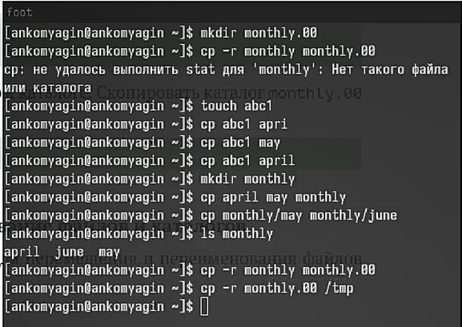
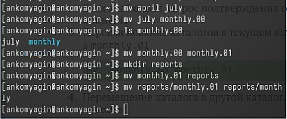
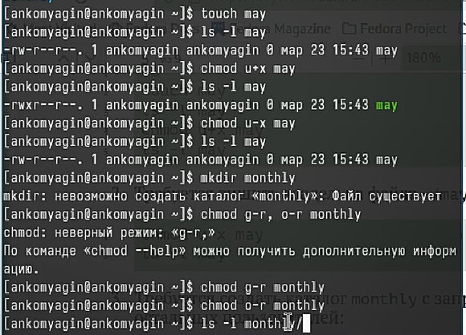
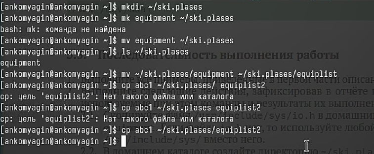
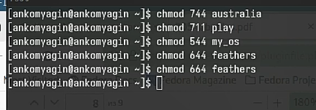
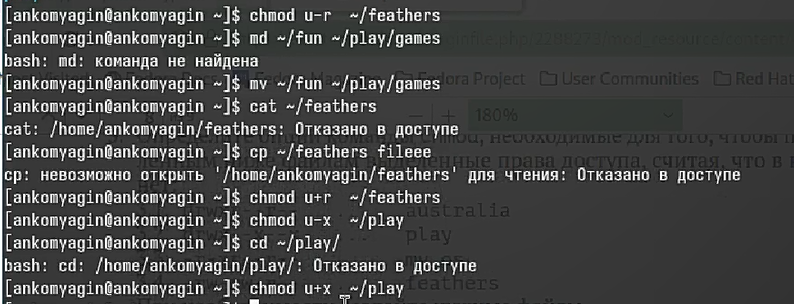
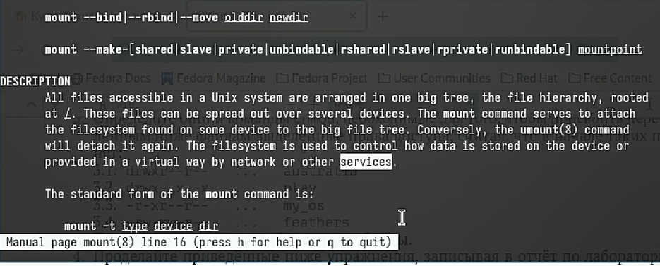

---
## Front matter
title: "Лабораторная работа №7"
subtitle: "Анализ файловой системы Linux. Команды для работы с файлами и каталогами"
author: "Комягин Андрей Николаевич"

## Generic otions
lang: ru-RU
toc-title: "Содержание"

## Bibliography
bibliography: bib/cite.bib
csl: pandoc/csl/gost-r-7-0-5-2008-numeric.csl

## Pdf output format
toc: true # Table of contents
toc-depth: 2
lof: true # List of figures
lot: true # List of tables
fontsize: 12pt
linestretch: 1.5
papersize: a4
documentclass: scrreprt
## I18n polyglossia
polyglossia-lang:
  name: russian
  options:
	- spelling=modern
	- babelshorthands=true
polyglossia-otherlangs:
  name: english
## I18n babel
babel-lang: russian
babel-otherlangs: english
## Fonts
mainfont: PT Serif
romanfont: PT Serif
sansfont: PT Sans
monofont: PT Mono
mainfontoptions: Ligatures=TeX
romanfontoptions: Ligatures=TeX
sansfontoptions: Ligatures=TeX,Scale=MatchLowercase
monofontoptions: Scale=MatchLowercase,Scale=0.9
## Biblatex
biblatex: true
biblio-style: "gost-numeric"
biblatexoptions:
  - parentracker=true
  - backend=biber
  - hyperref=auto
  - language=auto
  - autolang=other*
  - citestyle=gost-numeric
## Pandoc-crossref LaTeX customization
figureTitle: "Рис."
tableTitle: "Таблица"
listingTitle: "Листинг"
lofTitle: "Список иллюстраций"
lotTitle: "Список таблиц"
lolTitle: "Листинги"
## Misc options
indent: true
header-includes:
  - \usepackage{indentfirst}
  - \usepackage{float} # keep figures where there are in the text
  - \floatplacement{figure}{H} # keep figures where there are in the text
---

# Цель работы

Ознакомиться с файловой системой Linux, её структурой, именами и содержанием каталогов. Приобрести практические навыки по применению команд для работы с файлами и каталогами, по управлению процессами (и работами), по проверке использования диска и обслуживанию файловой системы.

# Выполнение лабораторной работы

Выполним все примеры, приведённые в первой части описания лабораторной работы.

Копирование и клонирование каталогов и файлов(рис. [-@fig:001]).

{#fig:001 width=70%}

Перенос и переименование файлов (рис. [-@fig:002]).

{#fig:002 width=70%}

Работа с правами доступа (рис. [-@fig:003])  

{#fig:003 width=70%}

Выполним следующие действия:
 
рис. [-@fig:004]).
1. Скопируем файл /usr/include/sys/io.h в домашний каталог и назовём его equipment.  cp
2. В домашнем каталоге создадим директорию ~/ski.plases. mkdir
3. Переместим файл equipment в каталог ~/ski.plases. mv
4. Переименуем файл ~/ski.plases/equipment в ~/ski.plases/equiplist. mv
5. Создадим в домашнем каталоге файл abc1 и скопируем его в каталог ~/ski.plases, назовём его equiplist2. touch
6. Создадим каталог с именем equipment в каталоге ~/ski.plases.
7. Переместим файлы ~/ski.plases/equiplist и equiplist2 в каталог ~/ski.plases/equipment.
8. Создадим и переместим каталог ~/newdir в каталог ~/ski.plases и назовём его plans.

{#fig:004 width=70%}

Определим опции команды chmod, необходимые для того, чтобы присвоить перечисленным ниже файлам выделенные права доступа, считая, что в начале таких прав нет (рис. [-@fig:005]).

{#fig:005 width=70%}

1. Просмотрим содержимое файла /etc/password. cat
2. Скопируем файл ~/feathers в файл ~/file.old. cp
3. Переместим файл ~/file.old в каталог ~/play. mv
4. Скопируем каталог ~/play в каталог ~/fun. cp
5. Переместим каталог ~/fun в каталог ~/play и назовите его games. mv
6. Лишим владельца файла ~/feathers права на чтение. chmod u-r
7. Что произойдёт, если мы попытаемся просмотреть файл ~/feathers командой cat? ограничено в доступе
8. Что произойдёт, если вы попытаемся скопировать файл ~/feathers? ограничено в доступе
9. Дадим владельцу файла ~/feathers право на чтение. chmod u+r
10. Лишите владельца каталога ~/play права на выполнение. chmod u-x
11. Перейдите в каталог ~/play. Что произошло? ограничено в доступе
12. Дайте владельцу каталога ~/play право на выполнение chmod u+x
 (рис. [-@fig:007]) 

{#fig:007 width=70%}

Посмотрим команды с помощью команды man (рис. [-@fig:008])

{#fig:008 width=70%}

# Вывод

В ходе выполнения лабораторной работы я приобрел практические навыки по применению команд для работы
с файлами и каталогами, по управлению процессами (и работами), по проверке использования диска и обслуживанию файловой системы.

# Список литературы{.unnumbered}

[Туис, курс Архитектура компьютера и операционные системы](https://esystem.rudn.ru/course/view.php?id=5790)
