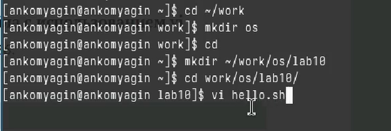
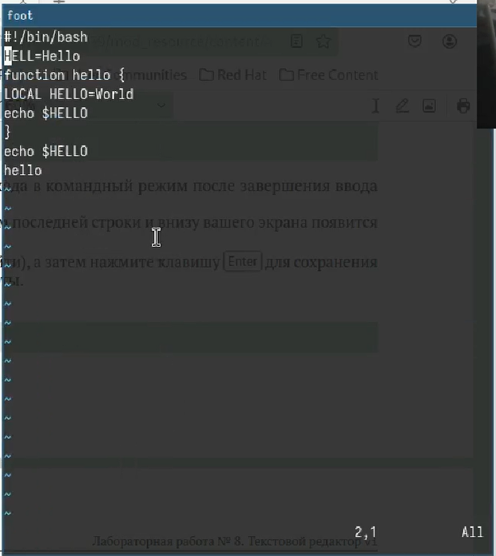
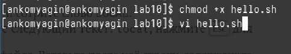

---
## Front matter
lang: ru-RU
title: Лабораторная работа №10
subtitle: Текстовой редактор vi
author:
  - Комягин А.Н.
institute:
  - Российский университет дружбы народов, Москва, Россия
date: 23 марта 2024

## i18n babel
babel-lang: russian
babel-otherlangs: english

## Formatting pdf
toc: false
toc-title: Содержание
slide_level: 2
aspectratio: 169
section-titles: true
theme: metropolis
header-includes:
 - \metroset{progressbar=frametitle,sectionpage=progressbar,numbering=fraction}
 - '\makeatletter'
 - '\beamer@ignorenonframefalse'
 - '\makeatother'

##Fonts
mainfont: PT Serif
romanfont: PT Serif
sansfont: PT Sans
monofont: PT Mono
mainfontoptions: Ligatures=TeX
romanfontoptions: Ligatures=TeX
sansfontoptions: Ligatures=TeX,Scale=MatchLowercase
monofontoptions: Scale=MatchLowercase,Scale=0.9
---

## Цель

Познакомиться с операционной системой Linux. Получить практические навыки работы с редактором vi, установленным по умолчанию практически во всех дистрибутивах.

# Выполнение лабораторной работы

## Подготовка

{width=90%}

## Cодержимое файла hello.sh

{width=95%}

## Сделаем файл исполняемым

{width=95%} 

## Редактирование файла

{width=95%}

# Контрольные вопросы

## Вопрос №1

Редактор vi имеет три основных режима работы: 

   - Командный режим (Command mode): В этом режиме можно перемещаться по тексту, удалять, копировать и вставлять символы, а также выполнять другие команды. Нет возможности напрямую вводить текст.
   
   - Режим ввода (Insert mode): В этом режиме можно вводить текст непосредственно в файл. 
   
   - Режим последней строки (Last line mode): В этом режиме можно вводить команды, которые выполняются через интерпретатор командной строки.

## Вопрос №2

Для выхода из редактора vi без сохранения изменений используется команда :q! в режиме последней строки.

## Вопрос №3

Команды позиционирования включают:

   - h - перемещение курсора влево
   
   - j - перемещение курсора вниз
   
   - k - перемещение курсора вверх
   
   - l - перемещение курсора вправо

## Вопрос №4

Для редактора vi словом является последовательность символов, разделенная пробелами или специальными символами. 

## Вопрос №5

Для перехода в начало файла используется команда gg, а для перехода в конец файла - команда G.

## Вопрос №6

Основные группы команд редактирования включают:

   - Команды изменения текста (удаление, вставка, замена)
   
   - Команды копирования и вставки
   
   - Команды отмены и повтора действий
   
   - Команды поиска и замены
   
   - Команды работы с отображением текста (прокрутка, переходы по экрану)

## Вопрос №7

Для заполнения строки символами $ можно использовать команду 80i$<Esc>, чтобы вставить символ $ 80 раз.

## Вопрос №8

Для отмены некорректного действия в редакторе vi используется команда u в режиме команд.

## Вопрос №9

Основные группы команд режима последней строки включают:

   - Команды сохранения изменений
   
   - Команды выхода из редактора
   
   - Команды поиска и замены
   
   - Команды отображения информации о файле и позиции курсора

## Вопрос №10

Для определения позиции, в которой заканчивается строка без перемещения курсора, можно воспользоваться командой :$ в режиме команд.

## Вопрос №11

Опции редактора vi могут быть изучены с помощью команды :set, а их назначение - с помощью команды :help options.

## Вопрос №12

Режим работы редактора vi отображается в нижней строке экрана, где может быть указано "Command mode" (командный режим), "Insert mode" (режим ввода) или "Last line mode" (режим последней строки).

## Вывод

Познакомился с операционной системой Linux. Получил практические навыки работы с редактором vi, установленным по умолчанию практически во всех дистрибутивах.

