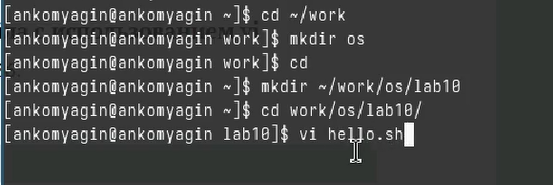
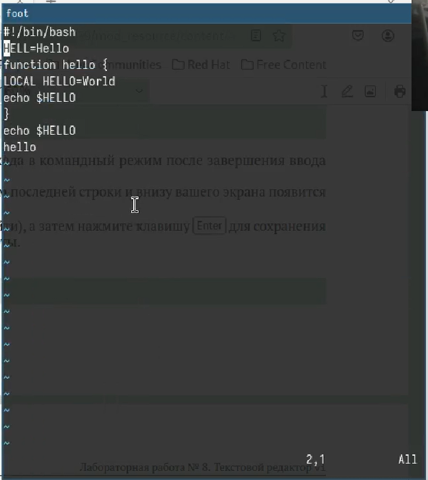
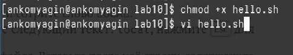
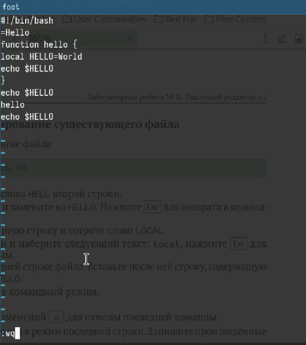

---
## Front matter
title: "Лабораторная работа №10"
subtitle: "Текстовой редактор vi"
author: "Комягин Андрей Николаевич"

## Generic otions
lang: ru-RU
toc-title: "Содержание"

## Bibliography
bibliography: bib/cite.bib
csl: pandoc/csl/gost-r-7-0-5-2008-numeric.csl

## Pdf output format
toc: true # Table of contents
toc-depth: 2
lof: true # List of figures
lot: true # List of tables
fontsize: 12pt
linestretch: 1.5
papersize: a4
documentclass: scrreprt
## I18n polyglossia
polyglossia-lang:
  name: russian
  options:
	- spelling=modern
	- babelshorthands=true
polyglossia-otherlangs:
  name: english
## I18n babel
babel-lang: russian
babel-otherlangs: english
## Fonts
mainfont: PT Serif
romanfont: PT Serif
sansfont: PT Sans
monofont: PT Mono
mainfontoptions: Ligatures=TeX
romanfontoptions: Ligatures=TeX
sansfontoptions: Ligatures=TeX,Scale=MatchLowercase
monofontoptions: Scale=MatchLowercase,Scale=0.9
## Biblatex
biblatex: true
biblio-style: "gost-numeric"
biblatexoptions:
  - parentracker=true
  - backend=biber
  - hyperref=auto
  - language=auto
  - autolang=other*
  - citestyle=gost-numeric
## Pandoc-crossref LaTeX customization
figureTitle: "Рис."
tableTitle: "Таблица"
listingTitle: "Листинг"
lofTitle: "Список иллюстраций"
lotTitle: "Список таблиц"
lolTitle: "Листинги"
## Misc options
indent: true
header-includes:
  - \usepackage{indentfirst}
  - \usepackage{float} # keep figures where there are in the text
  - \floatplacement{figure}{H} # keep figures where there are in the text
---

# Цель работы

Познакомиться с операционной системой Linux. Получить практические навыки работы с редактором vi, установленным по умолчанию практически во всех дистрибутивах.

# Выполнение лабораторной работы

Создадим каталог с именем ~/work/os/lab10. Перейдём во вновь созданный каталог. Вызовем vi и создадим файл hello.sh (рис. [-@fig:001]).

{#fig:001 width=70%}

Изменим содержимое файла через insert мод, созраним изменения (рис. [-@fig:002]).

{#fig:002 width=70%}

Сделаем файл исполняемым (рис. [-@fig:003])  

{#fig:003 width=70%}

Выполним ряд манипуляций с файлом (удаление, вставка, отмена действий) и сохраним изменения рис. [-@fig:004]).

{#fig:004 width=70%}

## Контрольные вопросы

1. Редактор vi имеет три основных режима работы: 
   - Командный режим (Command mode): В этом режиме можно перемещаться по тексту, удалять, копировать и вставлять символы, а также выполнять другие команды. Нет возможности напрямую вводить текст.
   - Режим ввода (Insert mode): В этом режиме можно вводить текст непосредственно в файл. 
   - Режим последней строки (Last line mode): В этом режиме можно вводить команды, которые выполняются через интерпретатор командной строки.

2. Для выхода из редактора vi без сохранения изменений используется команда :q! в режиме последней строки.

3. Команды позиционирования включают:
   - h - перемещение курсора влево
   - j - перемещение курсора вниз
   - k - перемещение курсора вверх
   - l - перемещение курсора вправо

4. Для редактора vi словом является последовательность символов, разделенная пробелами или специальными символами. 

5. Для перехода в начало файла используется команда gg, а для перехода в конец файла - команда G.

6. Основные группы команд редактирования включают:
   - Команды изменения текста (удаление, вставка, замена)
   - Команды копирования и вставки
   - Команды отмены и повтора действий
   - Команды поиска и замены
   - Команды работы с отображением текста (прокрутка, переходы по экрану)

7. Для заполнения строки символами $ можно использовать команду 80i$<Esc>, чтобы вставить символ $ 80 раз.

8. Для отмены некорректного действия в редакторе vi используется команда u в режиме команд.

9. Основные группы команд режима последней строки включают:
   - Команды сохранения изменений
   - Команды выхода из редактора
   - Команды поиска и замены
   - Команды отображения информации о файле и позиции курсора

10. Для определения позиции, в которой заканчивается строка без перемещения курсора, можно воспользоваться командой :$ в режиме команд.

11. Опции редактора vi могут быть изучены с помощью команды :set, а их назначение - с помощью команды :help options.

12. Режим работы редактора vi отображается в нижней строке экрана, где может быть указано "Command mode" (командный режим), "Insert mode" (режим ввода) или "Last line mode" (режим последней строки).

# Вывод

Познакомился с операционной системой Linux. Получил практические навыки работы с редактором vi, установленным по умолчанию практически во всех дистрибутивах.

# Список литературы{.unnumbered}

[Туис, курс Архитектура компьютера и операционные системы](https://esystem.rudn.ru/course/view.php?id=5790)
