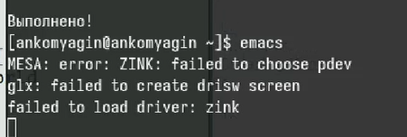
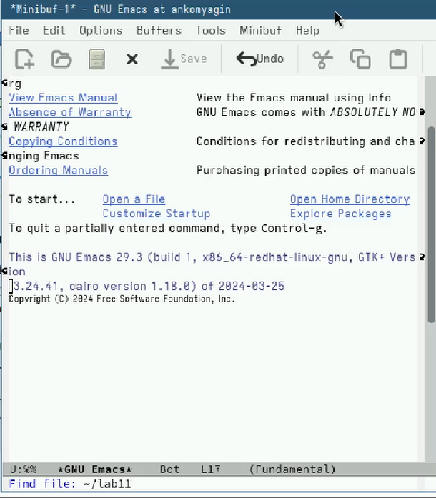
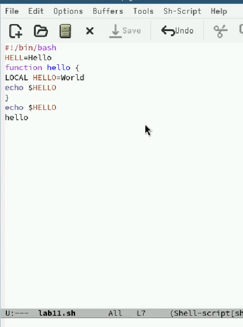
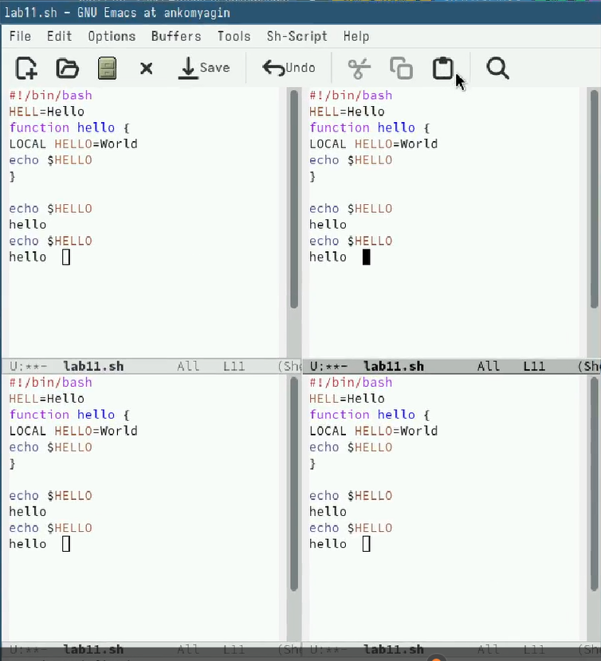
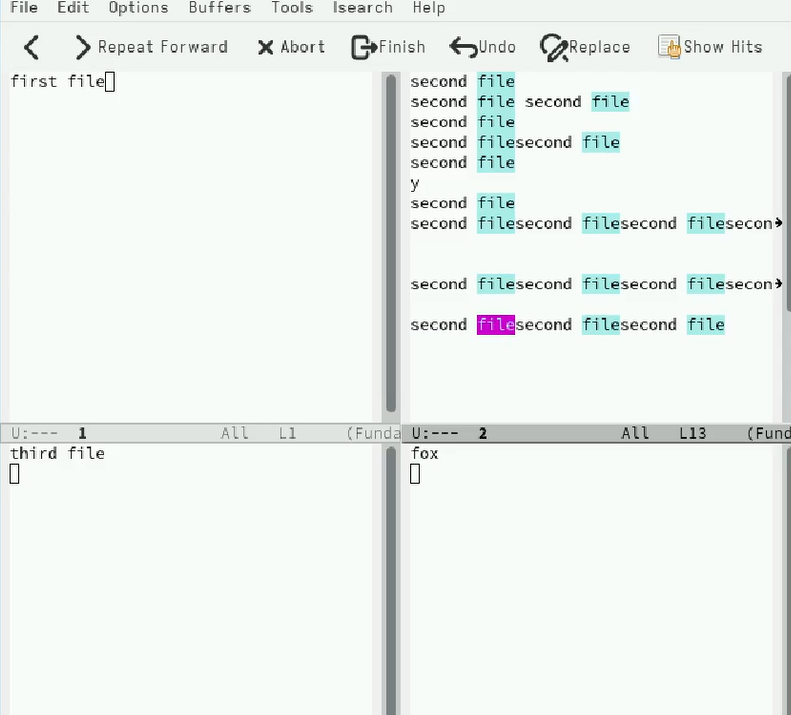
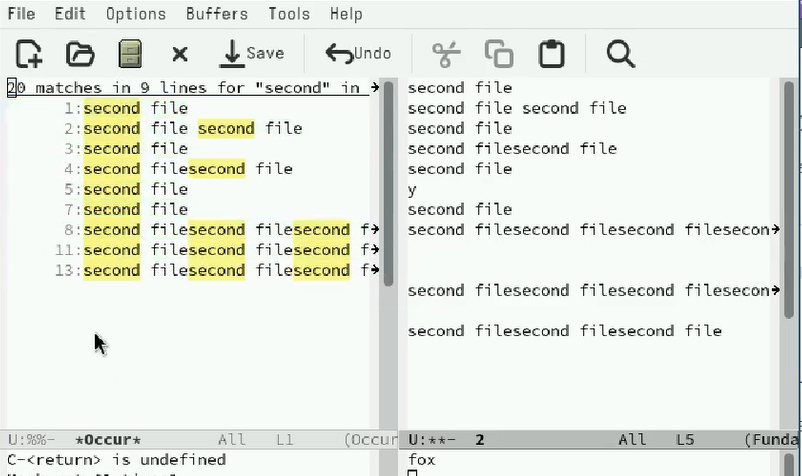

---
## Front matter
lang: ru-RU
title: Лабораторная работа №11
subtitle: Текстовой редактор emacs
author:
  - Комягин А.Н.
institute:
  - Российский университет дружбы народов, Москва, Россия
date: 20 апреля 2024

## i18n babel
babel-lang: russian
babel-otherlangs: english

## Formatting pdf
toc: false
toc-title: Содержание
slide_level: 2
aspectratio: 169
section-titles: true
theme: metropolis
header-includes:
 - \metroset{progressbar=frametitle,sectionpage=progressbar,numbering=fraction}
 - '\makeatletter'
 - '\beamer@ignorenonframefalse'
 - '\makeatother'

##Fonts
mainfont: PT Serif
romanfont: PT Serif
sansfont: PT Sans
monofont: PT Mono
mainfontoptions: Ligatures=TeX
romanfontoptions: Ligatures=TeX
sansfontoptions: Ligatures=TeX,Scale=MatchLowercase
monofontoptions: Scale=MatchLowercase,Scale=0.9
---

## Цель

Познакомиться с операционной системой Linux. Получить практические навыки работы с редактором Emacs.

# Выполнение лабораторной работы

## Запуск emacs

{width=90%}

## Создание файла lab11.sh

{width=95%}

## Заполнение файла

{width=95%} 

## Взаимодействие с буферами

{width=95%}

## Разделение фрейма

{width=95%}

## Режим поиска

{width=95%}

## Альтернативный режим поиска

{width=95%}

# Контрольные вопросы

## Вывод

Получил практические навыки работы с редактором Emacs.

