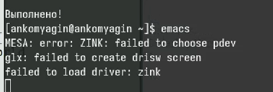
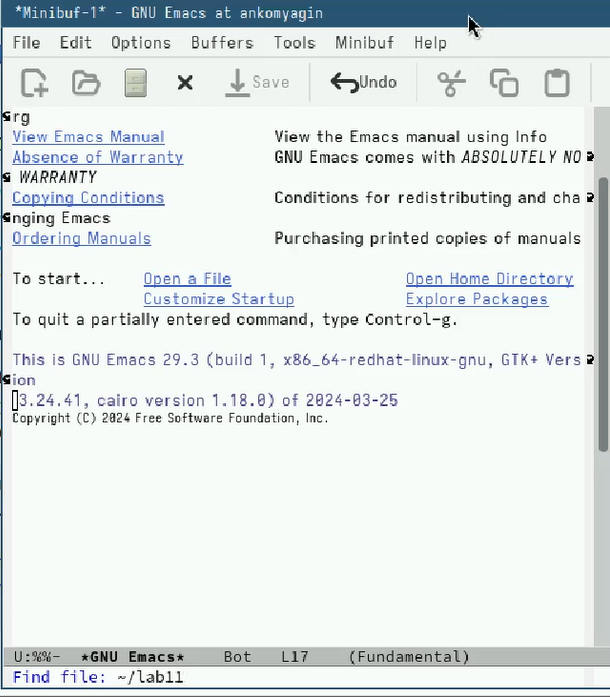
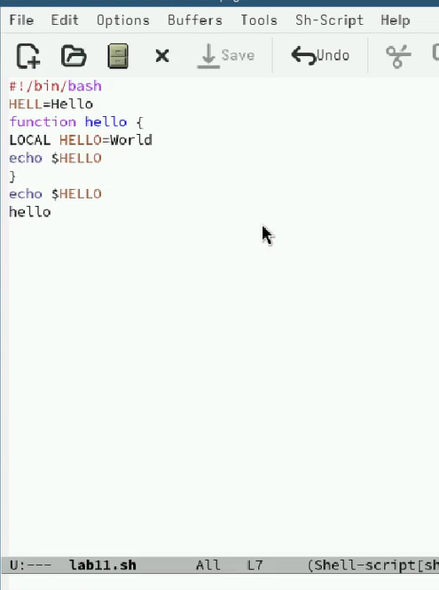
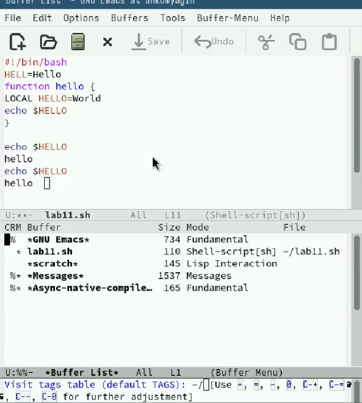
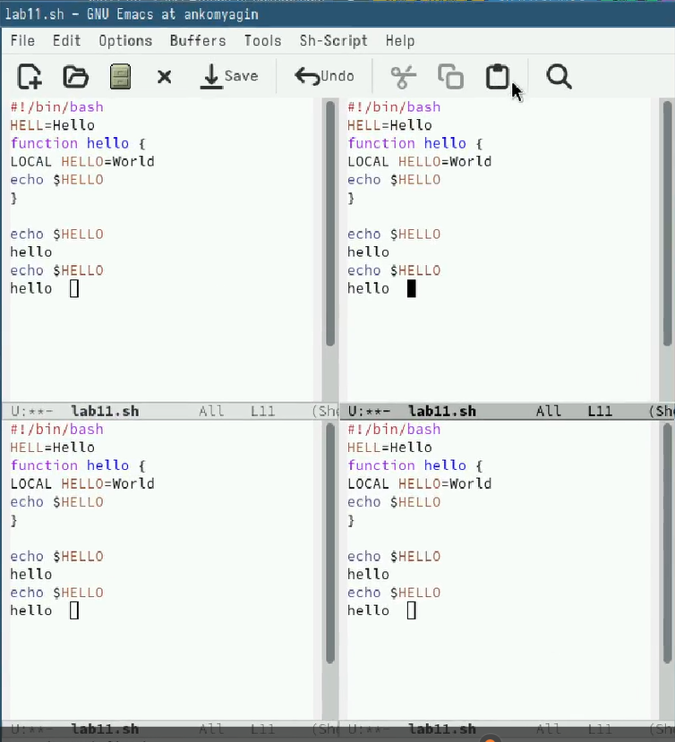
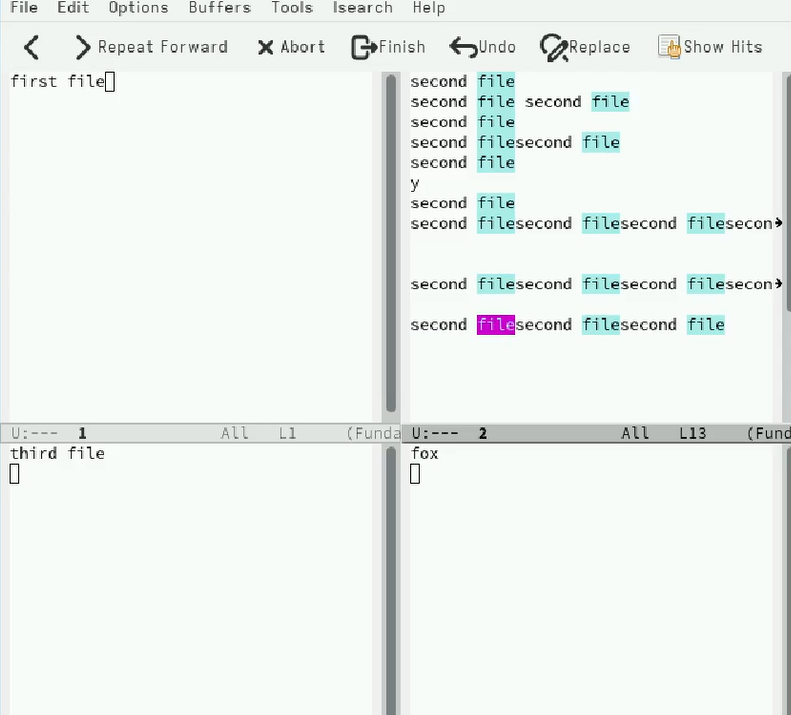
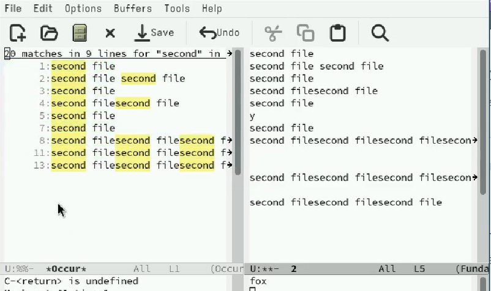

---
## Front matter
title: "Лабораторная работа №11"
subtitle: "Текстовой редактор emacs"
author: "Комягин Андрей Николаевич"

## Generic otions
lang: ru-RU
toc-title: "Содержание"

## Bibliography
bibliography: bib/cite.bib
csl: pandoc/csl/gost-r-7-0-5-2008-numeric.csl

## Pdf output format
toc: true # Table of contents
toc-depth: 2
lof: true # List of figures
lot: true # List of tables
fontsize: 12pt
linestretch: 1.5
papersize: a4
documentclass: scrreprt
## I18n polyglossia
polyglossia-lang:
  name: russian
  options:
	- spelling=modern
	- babelshorthands=true
polyglossia-otherlangs:
  name: english
## I18n babel
babel-lang: russian
babel-otherlangs: english
## Fonts
mainfont: PT Serif
romanfont: PT Serif
sansfont: PT Sans
monofont: PT Mono
mainfontoptions: Ligatures=TeX
romanfontoptions: Ligatures=TeX
sansfontoptions: Ligatures=TeX,Scale=MatchLowercase
monofontoptions: Scale=MatchLowercase,Scale=0.9
## Biblatex
biblatex: true
biblio-style: "gost-numeric"
biblatexoptions:
  - parentracker=true
  - backend=biber
  - hyperref=auto
  - language=auto
  - autolang=other*
  - citestyle=gost-numeric
## Pandoc-crossref LaTeX customization
figureTitle: "Рис."
tableTitle: "Таблица"
listingTitle: "Листинг"
lofTitle: "Список иллюстраций"
lotTitle: "Список таблиц"
lolTitle: "Листинги"
## Misc options
indent: true
header-includes:
  - \usepackage{indentfirst}
  - \usepackage{float} # keep figures where there are in the text
  - \floatplacement{figure}{H} # keep figures where there are in the text
---

# Цель работы

Познакомиться с операционной системой Linux. Получить практические навыки работы с редактором Emacs.

# Выполнение лабораторной работы

Запустим emacs (рис. [-@fig:001]).

{#fig:001 width=70%}

Создадим файл lab11.sh (рис. [-@fig:002]).

{#fig:002 width=70%}

Заполним файл (рис. [-@fig:003])  

{#fig:003 width=70%}

Проделаем с текстом стандартные процедуры редактирования, каждое действие осуществим комбинацией клавиш.

1. Вырежем одной командой целую строку (С-k).

2. Вставим эту строку в конец файла (C-y).

3. Выделим область текста (C-space).

4. Скопируем область в буфер обмена (M-w).

5. Вставим область в конец файла.

6. Вновь выделим эту область и на этот раз вырезать её (C-w).

7. Отменим последнее действие (C-/).

Научимся использовать команды по перемещению курсора.

1. Переместим курсор в начало строки (C-a).

2. Переместим курсор в конец строки (C-e).

3. Переместим курсор в начало буфера (M-<).

4. Переместим курсор в конец буфера (M->).

Проведем некоторые операции над буферами, например выведем список активных на экран (рис. [-@fig:004]).

{#fig:004 width=70%}

Разделим фрейм на 4 части (рис. [-@fig:005]).

{#fig:005 width=70%}

Переключимся в режим поиска (C-s) и найдём несколько слов, присутствующих в тексте (рис. [-@fig:006]).

{#fig:006 width=70%}

Испробуем другой режим поиска, нажав M-s o (рис. [-@fig:007]).

{#fig:007 width=70%}

# Вывод

В ходе лабораторной работы я (в очередной раз) познакомился с операционной системой Linux. Получил практические навыки работы с редактором Emacs.

# Список литературы{.unnumbered}

[Туис, курс Архитектура компьютера и операционные системы](https://esystem.rudn.ru/course/view.php?id=5790)
