---
## Front matter
title: "Лабораторная работа №13"
subtitle: "Дисциплина: Операционные системы"
author: "Комягин Андрей Николаевич"

## Generic otions
lang: ru-RU
toc-title: "Содержание"

## Bibliography
bibliography: bib/cite.bib
csl: pandoc/csl/gost-r-7-0-5-2008-numeric.csl

## Pdf output format
toc: true # Table of contents
toc-depth: 2
lof: true # List of figures
lot: true # List of tables
fontsize: 12pt
linestretch: 1.5
papersize: a4
documentclass: scrreprt
## I18n polyglossia
polyglossia-lang:
  name: russian
  options:
	- spelling=modern
	- babelshorthands=true
polyglossia-otherlangs:
  name: english
## I18n babel
babel-lang: russian
babel-otherlangs: english
## Fonts
mainfont: PT Serif
romanfont: PT Serif
sansfont: PT Sans
monofont: PT Mono
mainfontoptions: Ligatures=TeX
romanfontoptions: Ligatures=TeX
sansfontoptions: Ligatures=TeX,Scale=MatchLowercase
monofontoptions: Scale=MatchLowercase,Scale=0.9
## Biblatex
biblatex: true
biblio-style: "gost-numeric"
biblatexoptions:
  - parentracker=true
  - backend=biber
  - hyperref=auto
  - language=auto
  - autolang=other*
  - citestyle=gost-numeric
## Pandoc-crossref LaTeX customization
figureTitle: "Рис."
tableTitle: "Таблица"
listingTitle: "Листинг"
lofTitle: "Список иллюстраций"
lotTitle: "Список таблиц"
lolTitle: "Листинги"
## Misc options
indent: true
header-includes:
  - \usepackage{indentfirst}
  - \usepackage{float} # keep figures where there are in the text
  - \floatplacement{figure}{H} # keep figures where there are in the text
---

# Цель работы

Изучение основ программирования в оболочке ОС UNIX. Приобритение навыков в  написании более сложных командных файлов с использованием логических управляющих конструкций и циклов.


# Выполнение лабораторной работы

Начнем выполение задания со 2 пункта. Для этого создадим 2 файла - назовем их 13-2.sh и 13-2.с, запустим редактор emacs  для написания самого кода(рис. [-@fig:001]).
Не забудем прописать команду chmod +x для наделения файла правом на исполнение.

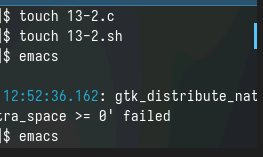{#fig:001 width=70%}

Реализуем задание - напишем код на с# и создадим командный файл, анализирующий этот код (рис. [-@fig:002]) (рис. [-@fig:003]).

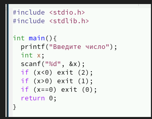{#fig:002 width=70%}


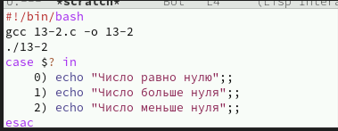{#fig:003 width=70%}


Программа 2

```
#!/bin/bash
gcc 13-2.c -o 13-2
./13-2
case $? in
    0) echo "Число равно нулю";;
    1) echo "Число больше нуля";;
    2) echo "Число меньше нуля";;
esac

```
	 


Запустим файл и проверим работу программы(рис. [-@fig:004]).

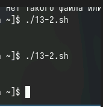{#fig:004 width=70%}


Далее перейдем к пункту 1.

Также создадим файл, назовем его 13-1.sh и наделим его правами на исполнение. Далее создадим 2 текстовых файла(в один добавим текст, а второй нужен для записи) и перейдем к написанию программы(рис. [-@fig:005]).

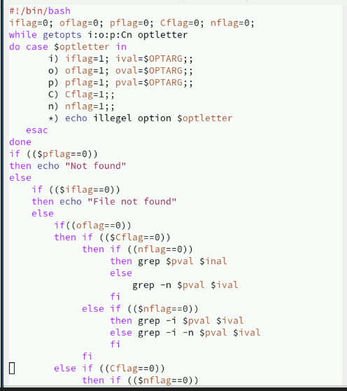{#fig:005 width=70%}

Программа 1

```
#!/bin/bash
iflag=0; oflag=0; pflag=0; Cflag=0; nflag=0;
while getopts i:o:p:Cn optletter
do case $optletter in
       i) iflag=1; ival=$OPTARG;;
       o) oflag=1; oval=$OPTARG;;
       p) pflag=1; pval=$OPTARG;;
       C) Cflag=1;;
       n) nflag=1;;
       *) echo illegel option $optletter
   esac
done
if (($pflag==0))
then echo "Not found"
else
    if (($iflag==0))
    then echo "File not found"
    else
	if((oflag==0))
	then if (($Cflag==0))
	     then if ((nflag==0))
		  then grep $pval $inal
		  else
		      grep -n $pval $ival
		  fi
	     else if (($nflag==0))
		  then grep -i $pval $ival
		  else grep -i -n $pval $ival
		  fi
	     fi
	else if ((Cflag==0))
	     then if (($nflag==0))
		  then grep $pval $ival > $oval
		  else grep -n $pval $ival > $oval
		  fi
	     else if (($nflag==0))
		  then grep -i $pval $ival > $oval
		  else grep -i -n $pval $ival >$oval
		  fi
	     fi
	fi
    fi
fi
```


Запустим наш файл и посмотрим на вывод(рис. [-@fig:006]).

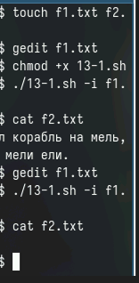{#fig:006 width=70%}


Затем создадим файл для 3й программы. Наделим правами доступ и перейдем к написанию кода(рис. [-@fig:007]) и (рис. [-@fig:008]).

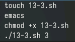{#fig:007 width=70%}


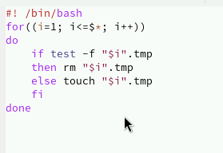{#fig:008 width=70%}

Программа 3

```
#! /bin/bash
for((i=1; i<=$*; i++))
do
    if test -f "$i".tmp
    then rm "$i".tmp
    else touch "$i".tmp
    fi
done
```

    
    

Запустим программу, убедимся, что все работает корректно - файлы создаются и удаляются(рис. [-@fig:009]).

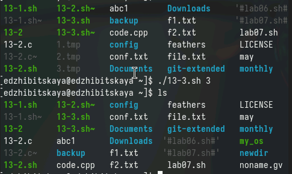{#fig:009 width=70%}


Наконец перейдем к 4 пункту.
Выполним те же действия, создав и написав программу для исполняемого файла(рис. [-@fig:010]) и (рис. [-@fig:011]).

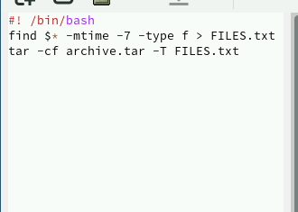{#fig:010 width=70%}

Программа 4

``` 
#! /bin/bash
find $* -mtime -7 -type f > FILES.txt
tar -cf archive.tar -T FILES.txt
```


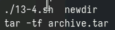{#fig:011 width=70%}

В результате запуска создается архив, с даннными из указанного каталога, причем с изменениями до 7 дней.

# Контрольные вопросы 

1. Команда getopts используется для обработки аргументов командной строки в скриптах Shell, чтобы сделать их более гибкими и управляемыми.

2. Метасимволы используются для шаблонного поиска и обработки файлов в командной оболочке UNIX. Они позволяют задавать шаблоны для поиска файлов с определенными именами или расширениями.

3. Операторы управления действиями включают в себя условные операторы (if-then-else), операторы цикла (for, while, until), операторы выбора (case).

4. Для прерывания цикла используются операторы break и continue.

5. Команда false возвращает ложное значение (код ошибки), а команда true - истинное значение (код успеха). Они могут быть использованы для управления потоком выполнения в скриптах.

6. Строка if test -f man$s/$i.$s проверяет, существует ли файл с именем, указанным в переменных $s и $i. Опция -f утилиты test указывает на проверку существования обычного файла.

7. Конструкция while выполняет цикл до тех пор, пока условие истинно, а конструкция until выполняет цикл до тех пор, пока условие ложно. Разница заключается в том, что в while условие проверяется перед выполнением тела цикла, а в until - после.

# Вывод
В ходе работы мы изучили основые программирования в оболочке UNIX, написали несколько более сложных командных файлов.

