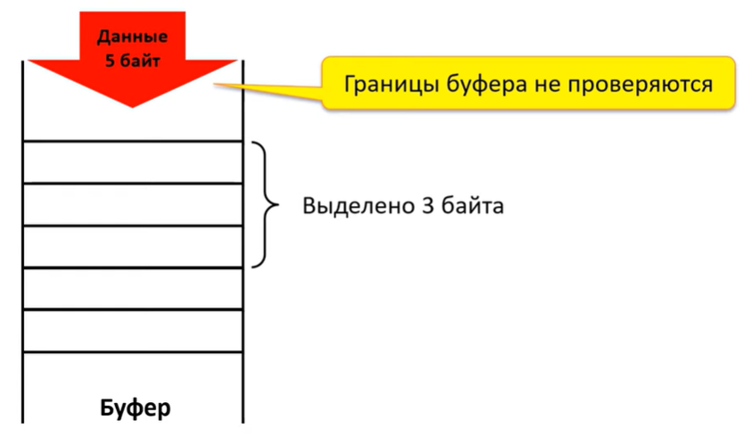
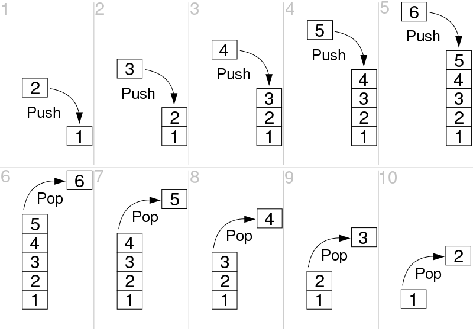
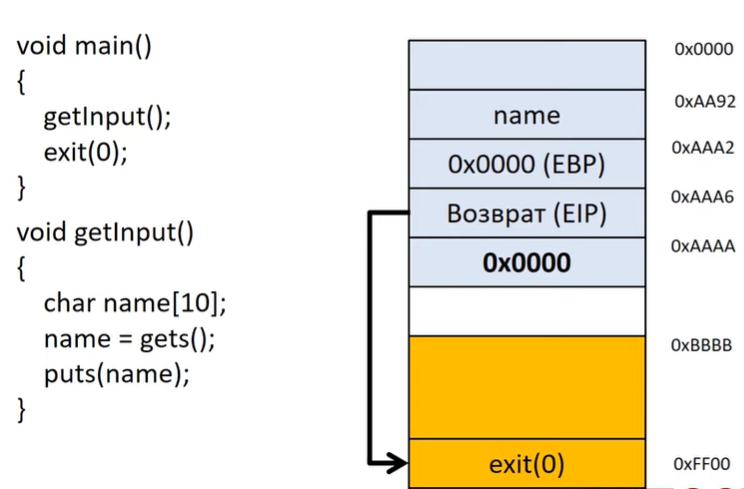
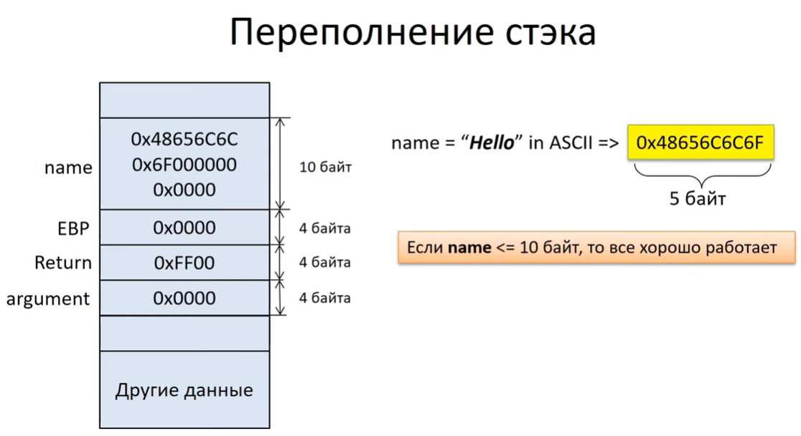
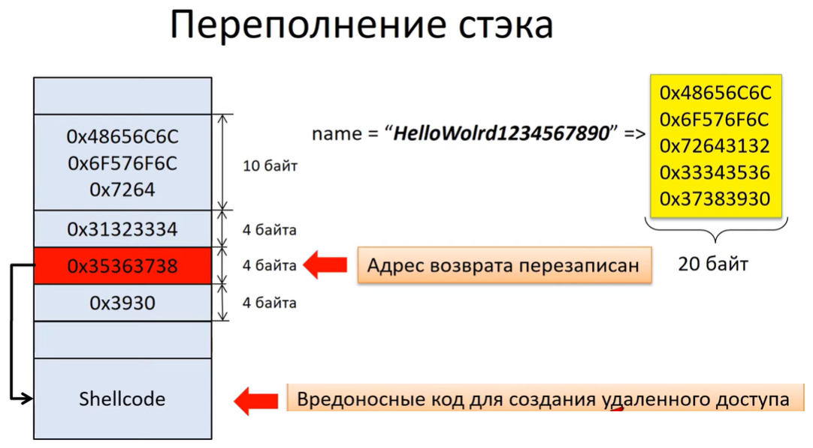

---
## Front matter
lang: ru-RU
title: Доклад по теме
subtitle: Методы защиты от атаки типа переполнение буфера
author:
  - Комягин А.Н.
institute:
  - Российский университет дружбы народов, Москва, Россия
date: 2 апреля 2024

## i18n babel
babel-lang: russian
babel-otherlangs: english

## Formatting pdf
toc: false
toc-title: Содержание
slide_level: 2
aspectratio: 169
section-titles: true
theme: metropolis
header-includes:
 - \metroset{progressbar=frametitle,sectionpage=progressbar,numbering=fraction}
 - '\makeatletter'
 - '\beamer@ignorenonframefalse'
 - '\makeatother'

##Fonts
mainfont: PT Serif
romanfont: PT Serif
sansfont: PT Sans
monofont: PT Mono
mainfontoptions: Ligatures=TeX
romanfontoptions: Ligatures=TeX
sansfontoptions: Ligatures=TeX,Scale=MatchLowercase
monofontoptions: Scale=MatchLowercase,Scale=0.9
---

# Введение

##  Актуальность

В современном мире защита от кибератак становится все более важной задачей. Одним из наиболее распространенных методов атак является **атака типа переполнение буфера**. 

Мы рассмотрим принцип атаки, методы защиты от таких атак, их принципы работы и эффективность.

Понимание и применение этих методов играют ключевую роль в обеспечении безопасности информационных систем и защите конфиденциальности данных.

## История атаки

В 1988 году вирус-червь Морриса стал одним из первых крупных кибератак, использующих атаку типа переполнение буфера.

{width=75%}

# Принцип атаки

## Основные понятия

* **Буфер** - динамически выделяемая область памяти для хранения временных данных

* **Переполнение буфера** - вид уязвимости, когда программа записывает данные за пределы выделенной памяти, вызывая при этом сбой программы или выполнение вредоносного кода.

## Уязвимость в записи

**Уязвимость в записи** - запись переизбыточного количества информации, которое вызывает перезапись важных ссылок.

{width=80%}

## Виды атак

Выделяется 3 вида атак:

1. **Stack overflow** - атака переполнения стэка

2. **Heap overflow** - атака переполнения кучи

3. **Format string** - атака форматирования строки

Мы будем рассматривать атаку на примере переполнения стэка.

## Работа стэка

**Стэк** (stack) — структура данных, работающая по принципу **LIFO — last in, first out**. Стек напоминает стопку тарелок. Тарелка, которую положили первой, в самый низ, будет использована последней. Стэк хранит аргументы и значения переменных функций.

{width=50%}

## Регистры процессора, для работы со стэком

Работой стэка руководят 3 регистра процессора:

1. **ESP** - Extended Stack Pointer - указывает на вершину стэка

2. **EBP** - Extended Base Pointer - используется для доступа к данным в стэке

3. **EIP** - Extended Instruction Pointer - содержит адрес следующей инструкции для выполнения

## Пример кода и стэка

{width=90%}

## Подразумеваемая работа программы

{width=90%}

## Уязвимость в работе программы

{width=90%}

# Защита от атаки типа переполнение буфера

## Основная причина уязвимости

Возможность атаки появляется из-за брешей в исходном коде программы.

{width=45%} {width=45%}

## Использование защищенных ЯП

Человечество разработало защищенные языки, такие как **Rust, Java, .NET, Python, JavaScript, Lua, C#** ...

Из-за популярности **C**, переполнение буфера остается важной брешью в безопасности.

Также большое количество кода унаследовано от **С** и используется в ядрах ОС и популярных библиотеках.

## Исправление уязвимостей

В ходе разработки, можно использовать специальные средства анализа исходного кода и запущенных программ, стараясь обнаружить опасные конструкции или ошибки переполнения до того, как эти баги попадут в релиз. Новые средства, такие как **AddressSanitizer** и более старые, как **Valgrind** дают такие возможности.

Однако, эти оба этих инструмента требуют активного вмешательства разработчика, что означает, что не все программы их используют.

## Защита внутри ОС

Разработчики операционных систем и компиляторов внедрили ряд механизмов, усложняющих эксплуатацию этих уязвимостей.

Некоторые из этих систем нацелены на усложнение конкретных атак. Один из наборов патчей для Linux делает так, что все системные библиотеки загружаются в нижние адреса таким образом, чтобы содержать, по крайней мере, один нулевой байт в своём адресе; это существенно усложняет их использование в переполнениях эксплуатирующих обработку строк в C.

## Защита в компиляторах canary

Во многих компиляторах имеется какой-либо род защиты стека. Определяемое на этапе исполнения значение, называемое **"канарейкой" (canary)** пишется в конец стека рядом с адресом возврата. В конце каждой функции, это значение проверяется перед выполнением инструкции возврата. Если значение канарейки изменилось (по причине перезаписи в ходе переполнения), программа немедленно рухнет вместо продолжения.

## Уязвимость canary

1. Перезапись canary

2. Утечка информации

3. Брутфорс

4. Отключение защиты canary, уязвимости в самой защите

## Защита NX (разделение памяти)

Система старается разделить память на записываемую (подходящую для буферов) и исполнимую (подходящую для библиотек и программного кода), но не одновременно ту и другую. Таким образом, даже если атакующий может переполнить буфер и контролировать адрес возврата, процессор не будет выполнять шеллкод.

## Уязвимость NX

Существует метод обхода защиты - **трамплин**, передающий контроль шеллкоду в стековом буфере через инструкцию расположенную в другой библиотеке или исполнимом файле. Злоумышленник будет использовать уязвимости в библиотеке или исполняемом файле, чтобы уже оттуда выполнить свой код.

## Защита ASLR (рандомизация)

**ASLR** (Address Space Layout Randomization, Рандомизация развёртки адресного пространства): он делает случайной позицию стека и расположение в памяти библиотек и исполнимого кода. Обычно они меняются при каждом запуске программы.

Данное обстоятельство значительным образом осложняет эксплуатацию, поскольку, совершенно неожиданно, атакующий не знает где лежат нужные для ROP фрагменты инструкций, или хотябы где находится переполняемый стек.

## Минусы и слабости ASLR

С ASLR программы и библиотеки не могут полагаться в своей работе на значение адреса, в который они загружены. 

ASLR тяжелее внедрить в существующие программы.

ALSR не совершенен. Одним из ограничений является степень случайности, которую можно получить, особенно заметную на 32-битных системах. Результаты бывают различными, но иногда атакующий могут угадать нужный адрес, с высокой вероятностью попадания.

# Вывод

## Вывод

Между теми, кто эксплуатирует уязвимости и теми, кто защищает, идёт постоянная гонка вооружений. Мощные защитные системы, вроде ASLR и NX, поднимают планку, усложняя использование недостатков, и благодаря им мы оставили времена простого переполнения буфера позади, но умные атакующие могут найти комбинацию дыр и обойти эти защитные меры.

Для обеспечения безопасности необходимо использовать все методы защиты и писать код грамотно.
