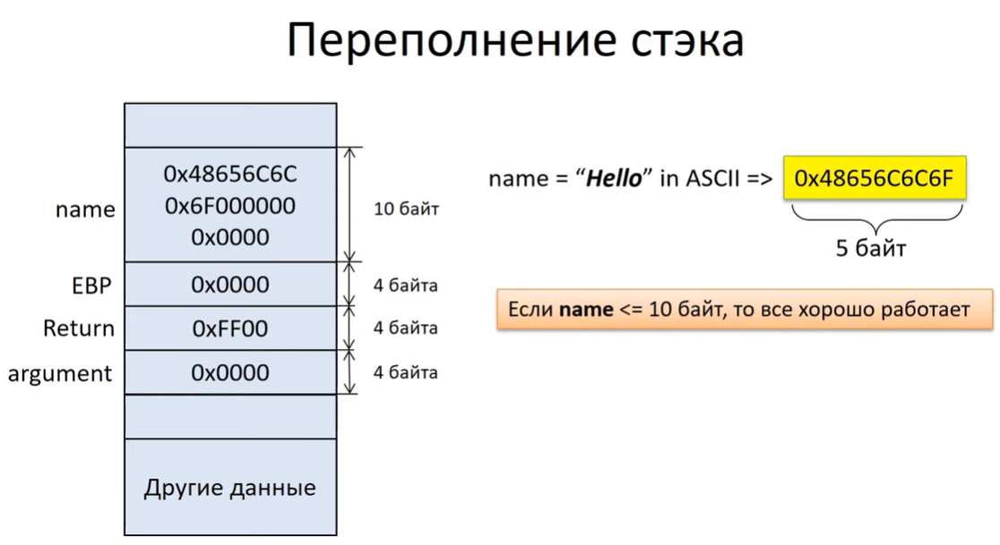
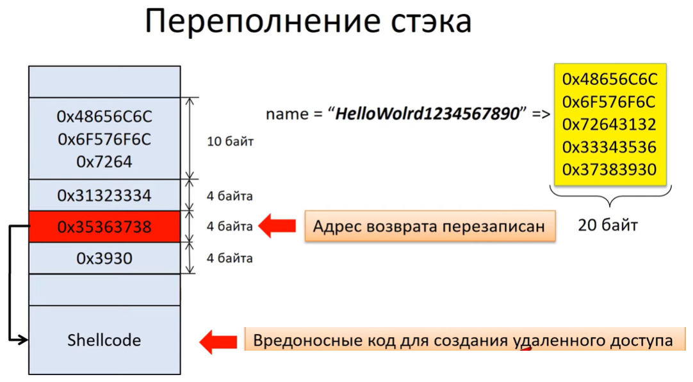

---
## Front matter
title: "Реферат по теме"
subtitle: "Методы защиты от атаки типа переполнение буфера"
author: "Комягин Андрей Николаевич"

## Generic otions
lang: ru-RU
toc-title: "Содержание"

## Bibliography
bibliography: bib/cite.bib
csl: pandoc/csl/gost-r-7-0-5-2008-numeric.csl

## Pdf output format
toc: true # Table of contents
toc-depth: 2
lof: true # List of figures
lot: true # List of tables
fontsize: 12pt
linestretch: 1.5
papersize: a4
documentclass: scrreprt
## I18n polyglossia
polyglossia-lang:
  name: russian
  options:
	- spelling=modern
	- babelshorthands=true
polyglossia-otherlangs:
  name: english
## I18n babel
babel-lang: russian
babel-otherlangs: english
## Fonts
mainfont: PT Serif
romanfont: PT Serif
sansfont: PT Sans
monofont: PT Mono
mainfontoptions: Ligatures=TeX
romanfontoptions: Ligatures=TeX
sansfontoptions: Ligatures=TeX,Scale=MatchLowercase
monofontoptions: Scale=MatchLowercase,Scale=0.9
## Biblatex
biblatex: true
biblio-style: "gost-numeric"
biblatexoptions:
  - parentracker=true
  - backend=biber
  - hyperref=auto
  - language=auto
  - autolang=other*
  - citestyle=gost-numeric
## Pandoc-crossref LaTeX customization
figureTitle: "Рис."
tableTitle: "Таблица"
listingTitle: "Листинг"
lofTitle: "Список иллюстраций"
lotTitle: "Список таблиц"
lolTitle: "Листинги"
## Misc options
indent: true
header-includes:
  - \usepackage{indentfirst}
  - \usepackage{float} # keep figures where there are in the text
  - \floatplacement{figure}{H} # keep figures where there are in the text
---

# Введение

## Атака типа "переполнение буфера"

В современном информационном мире защита от кибератак становится все более актуальной и важной задачей. Одним из наиболее распространенных методов атак является атака типа переполнение буфера, которая может привести к серьезным последствиям для системы и данных. В данном реферате мы рассмотрим различные методы защиты от атак типа переполнение буфера, их принципы работы и эффективность в предотвращении подобных угроз. Понимание и применение этих методов играют ключевую роль в обеспечении безопасности информационных систем и защите конфиденциальности данных.

## Одна из первых крупных кибератак, использующая переполнение буфера

В 1988 году вирус-червь Морриса стал одним из первых крупных кибератак, использующих атаку типа переполнение буфера. Этот вирус был разработан Робертом Таппаном Моррисом-младшим, студентом Корнеллского университета, и был распространен через интернет. Вирус-червь Морриса поражал компьютеры, использующие UNIX операционную систему, путем переполнения буфера в программе отправки электронной почты. Эта атака привела к серьезным последствиям, таким как замедление работы сетей и отказ в обслуживании.

Из-за масштабов и разрушительности атаки червя Морриса было понятно, что защита от атак типа переполнение буфера становится критически важной для обеспечения безопасности информационных систем. В результате этого инцидента были разработаны новые методы защиты от подобных угроз, которые продолжают использоваться и совершенствоваться в настоящее время.

# Принцип атаки

## Основные понятия

**Буфер** - динамически выделяемая область памяти для хранения временных данных
**Переволнение буфера** - вид уязвимости, когда программа записывает данные за пределы выделенной памяти, вызывая при этом сбой программы или выполнение вредоносного кода.
**Уязвимость в записи**(рис. [-@fig:001])

## Виды атак

Существуют разные атаки типа "переполнения буфера":
1. Stack overflow - атака переполнения стэка
2. Heap overflow - атака переполнения кучи
3. Format string - атака форматирования строки

Чтобы понять, почему происходит переполнение буфера — и почему результаты столь плачевны — нам нужно рассмотреть то, как программы используют память, и как программисты пишут код.

## Принцип атаки stack overflow

### Работа стэка
Рассмотрим переполнение буфера на основе стэка, так как он является классическим и наиболее изученным видом

Стэк (stack) — структура данных, которая работает по принципу «последним пришёл, первым ушёл» (LIFO — last in, first out). Стек можно представить как некий контейнер, в котором элементы (например, числа, символы и так далее) могут быть добавлены в вершину, а затем извлечены только из вершины. В бытовом плане стек напоминает стопку тарелок. Тогда тарелка, которую положили первой, в самый низ, будет использована последней.

Стэк хранит аргументы и значения переменных функций.

Работой стэка руководят 3 регистра процессора:
1. ESP - Extended Stack Poinet - указывает на вершину стэка
2. EBP - Extended Base Pointer - используется для доступа к данным в стэке
3. EIP - Extended Instruction Poiter - содержит адрес следующей инструкции для выполнения

Более подробно разбирать работу стэка не будем, так как данной теме можно посвятить отдельное выступление, а наша цель - узнать методы защиты от атак типа "переполнения буфера".

### Переполнение стэка

Представим абстрактный код 
''' c

void main()
{
   getInput();
   exit(0);
}
void getInput()
{
   char name[10]
   name = gets();
   puts(name)
}

'''

Код состоит из функции main, из которой идет вызов функции getInput.
Внутри getInput создаётся переменная name, под которую выделяется 10 байт памяти. Далее происходит запись в переменную при помощи команды gets, а затем выводится командой puts.

**gets** - функци языка си, осуществляющая считывание строки данных со стандартного ввода (что, обычно, означает „клавиатуру“), и помещающая её в буфер. Функция gets() не включает параметр размера буфера, и как забавный факт дизайна C, отсутствует способ для функции gets() определить размер буфера самостоятельно. Это потому, что для gets() это просто не важно: функция будет читать из стандартного ввода, пока человек за клавиатурой не нажмёт клавишу Ввод; потом функция попытается запихнуть всё это в буфер, даже если этот человек ввёл много больше, чем помещается в буфер. Это функция, которую в буквальном смысле нельзя использовать безопасно. Поскольку нет способа ограничить количество набираемого с клавиатуры текста, нет и способа предотвратить переполнение буфера функцией gets(). Создатели стандарта языка C быстро поняли проблему; версия спецификации C от 1999 года выводила gets() из обращения, а обновление от 2011 года полностью убирает её. Но её существование — и периодическое использование — показывают, к кого рода ловушки готовит C своим пользователям.

Мы выделили 10 байт памяти для переменной name в стэке. Если размер строки не превышает размера выделенной памяти, то программа работает, как и задумывалось (рис. [-@fig:002]).

{#fig:002 width=70%}

Если же размер строки на входе превышает размер выделенной в буфер памяти, то возникает ошибка переполнения буфера (рис. [-@fig:003]).  

{#fig:003 width=70%}

Из иллюстрации видно, что если в буфер name будет записано более 10 байт, то другие значения в стеке будут повреждены (адрес возврата будет перезаписан).

Очевидно, что это ведёт к повреждению данных программы, но проблема с переполнением буфера куда серьёзнее: они ведут к выполнению [произвольного] кода. Это происходит потому, что переполненный буфер не просто перезапишет данные. Также могут оказаться перезаписаны более важные вещи, хранимые в стеке — адреса возврата. Адрес возврата контролирует то, какие инструкции процессор будет выполнять, когда закончит с текущей функцией; предполагается, что это будет какой-то адрес внутри вызывающей функции, но если это значение будет переписано переполнением буфера, оно может указывать куда угодно. Если атакующие могут контролировать переполнение буфера, то они могут контролировать и адрес возврата. Если они контролируют адрес возврата, они могут указать процессору, что делать дальше.

Тот же буфер, который используется для изменения адреса возврата, можно использовать для хранения небольшого куска исполнимого кода (shellcode, шеллкод), который, в свою очередь, скачает вредоносный исполнимый файл, или откроет сетевое соединение, или исполнит любые другие пожелания атакующего.

Традиционно, сделать это было тривиально просто, по причине, которая у многих вызывает удивление: обычно, каждая программа будет использовать одни и те же адреса в памяти при каждом запуске, даже если вы перезагружали машину. Это означает, что позиция буфера в стеке всякий раз будет одинакова, а значит и значение, используемое для искажения адреса возврата, каждый раз будет одинаково. Атакующему достаточно лишь выяснить этот адрес однажды, и атака сработает на любом компьютере, исполняющем уязвимый код.

# Защита от атаки

## Коротко о ЯП

Конечно, человечество разработало множество языков в которых осуществляется проверка чтения и записи в буферы, что защищает от переполнения. Компилируемые языки, такие как поддерживаемый Mozilla язык Rust, защищённые среды исполнения вроде Java и .NET, и практически все скриптовые языки вроде Python, JavaScript, Lua и Perl имеют иммунитет к этой проблеме (хотя в .NET разработчики могут явным образом отключить защиту и подвергнуть себя подобному багу, но это личный выбор).

Тот факт, что переполнение буфера продолжает оставаться частью ландшафта безопасности, говорит о популярности C. Одой из причин этого, конечно, является большое количество унаследованного кода. В мире существует огромное количество кода на C, включая ядра всех основных операционных систем и популярных библиотек, таких как OpenSSL. Даже если разработчики хотят использовать безопасный язык, вроде C#, у них могут оставаться зависимости от сторонних библиотек, написанных на C.

Производительность является другой причиной продолжающегося использования C, хотя смысл такого подхода не всегда понятен. Верно, что компилируемые C и С++ обычно выдают быстрый исполняемый код, и в некоторых случаях это действительно очень важно. Но у многих из нас процессоры большую часть времени простаивают; если бы мы могли пожертвовать, скажем, десятью процентами производительности наших браузеров, но при этом получить железную гарантию невозможности переполнения буфера — и других типичных дыр, мы может быть бы решили, что это не плохой размен. 

## Предупреждение уязвимостей на стадии разработки

В ходе разработки, можно использовать специальные средства анализа исходного кода и запущенных программ, стараясь обнаружить опасные конструкции или ошибки переполнения до того, как эти баги пролезут в релиз. Новые средства, такие как **AddressSanitizer** и более старые, как **Valgrind** дают такие возможности.

Однако, эти оба этих инструмента требуют активного вмешательства разработчика, что означает, что не все программы их используют.

## Защита внутри ОС

Разработчики операционных систем и компиляторов внедрили ряд механизмов, усложняющих эксплуатацию этих уязвимостей.

Некоторые из этих систем нацелены на усложнение конкретных атак. Один из наборов патчей для Linux делает так, что все системные библиотеки загружаются в нижние адреса таким образом, чтобы содержать, по крайней мере, один нулевой байт в своём адресе; это существенно усложняет их использование в переполнениях эксплуатирующих обработку строк в C.

## Защита в компиляторах

Другие средства защиты действуют более обще. Во многих компиляторах имеется какой-либо род защиты стека. Определяемое на этапе исполнения значение, называемое „канарейкой“ (canary) пишется в конец стека рядом с адресом возврата. В конце каждой функции, это значение проверяется перед выполнением инструкции возврата. Если значение канарейки изменилось (по причине перезаписи в ходе переполнения), программа немедленно рухнет вместо продолжения.

## Защита NX

Возможно, важнейшим из средств защиты является механизм известный под именами W^X (»write exclusive-or execute"), DEP («data execution prevention»), NX («No Xecute»), XD («eXecute Disable»), EVP («Enhanced Virus Protection,» специфичный для AMD термин), XN («eXecute Never»), и, вероятно, другими. Здесь принцип прост. Эти системы стараются разделить память на записываемую (подходящую для буферов) и исполнимую (подходящую для библиотек и программного кода), но не одновременно ту и другую. Таким образом, даже если атакующий может переполнить буфер и контролировать адрес возврата, процессор не будет выполнять шеллкод.

Как бы вы его не назвали, это важный механизм ещё и потому, что он не требует вложений. Этот подход использует защитные меры встроенные в процессор, поскольку это часть механизма аппаратной поддержки виртуальной памяти.

Одним из интересных моментов NX является то, что его можно применить к существующим программам «задним числом», просто путём обновления операционной системы до той, что поддерживает защиту.

## Уязвимость в NX

Несмотря на распространение поддержки NX, переполнение буфера остаётся актуальной проблемой информационной безопасности. Причиной тому является разработка ряда способов обхода NX.

Первый из них был похож на вышеописанный трамплин, передающий контроль шеллкоду в стековом буфере через инструкцию расположенную в другой библиотеке или исполнимом файле. Вместо того чтобы искать фрагмент исполнимого кода, который бы передал управление напрямую в стек, атакующий находит фрагмент, который сам делает что-то полезное.

Возможно, лучшим кандидатом на эту роль является Unix-функция system(). Она принимает один параметр: адрес строки, представляющей собой команду для исполнения — и обычно этот параметр передаётся через стек. Атакующий может создать нужную команду и поместить её в переполняемый буфер, а поскольку (традиционно) расположение объектов в памяти неизменно, адрес этой строки будет известен и может быть помещён на стек в ходе атаки. Переписанный адрес возврата в этом случае не указывает на адрес в буфере; он указывает на функцию system(). Когда функция подверженная переполнению завершает работу, вместо возврата в вызывающую функцию она запустит system(), что приведёт к исполнению заданной атакующим команды.

## Рандомизация

Слабость NX давно известна, и эксплойты такого типа шаблоны: атакующий заранее знает адрес стека и системных библиотек в памяти. Всё держится на этом знании, а потому очевидным решением является лишить атакующего этого знания. Именно этим занимается **ASLR** (Address Space Layout Randomization, Рандомизация развёртки адресного пространства): он делает случайной позицию стека и расположение в памяти библиотек и исполнимого кода. Обычно они меняются при каждом запуске программы, перезагрузке или некоторой их комбинации.

Данное обстоятельство значительным образом осложняет эксплуатацию, поскольку, совершенно неожиданно, атакующий не знает где лежат нужные для ROP фрагменты инструкций, или хотябы где находится переполняемый стек.

ASLR во многом сопутствует NX, закрывая такие крупные дыры как возврат к libc или ROP. К несчастью, он несколько менее прозрачен, чем NX. Не считая JIT-компиляторов и ряда других специфичных случаев, NX может быть безопасно внедрён в существующие программы. ASLR более проблематичен: с ним программы и библиотеки не могут полагаться в своей работе на значение адреса, в который они загружены.

В Windows, например, это не должно быть большой проблемой для DLL. В Windows, DLL всегда поддерживали загрузку в разные адреса, а вот для EXE это может быть проблемой. До ASLR, EXE всегда загружались в адрес 0x0040000 и могли полагаться на этот факт. С внедрением ASLR это уже не так. Чтобы предотвратить возможные проблемы, Windows по умолчанию требует от программ явного указания поддержки ASLR. Люди, думающие о безопасности, могут, однако, изменить это поведение по умолчанию, заставив Windows включить ASLR для всех программ и библиотек. Это почти никогда не вызывает проблем.

Ситуация вероятно хуже в Linux на x86, поскольку подход к реализации ASLR на этой платформе даёт потерю производительности до 26 процентов. Более того, этот подход требует компиляции программ и библиотек с поддержкой ASLR.

ALSR не совершенен. Одним из ограничений является степень случайности, которую можно получить, особенно заметную на 32-битных системах. Результаты бывают различными, но иногда атакующий могут угадать нужный адрес, с высокой вероятностью попадания. Даже невысокого шанса — скажем, один из 256 — может быть достаточно в некоторых ситуациях. Когда атакуешь веб-сервер, который автоматически перезапустит рухнувший процесс, не важно, что 255 из 256 атак приведут к краху процесса. Он будет перезапущен, и можно попробовать снова.

# Вывод

Между теми, кто эксплуатирует уязвимости и теми, кто защищает, идёт постоянная гонка вооружений. Мощные защитные системы, вроде ASLR и NX, поднимают планку, усложняя использование недостатков, и благодаря им мы оставили времена простого переполнения буфера позади, но умные атакующие могут найти комбинацию дыр и обойти эти защитные меры.

Эскалация продолжается. Набор Microsoft EMET («Enhanced Mitigation Experience Toolkit», «расширенный набор инструментов противодействия») включает ряд полу-экспериментальных средств защиты, которые могут обнаруживать heap spraying или попытки вызова определённых критичных функций в ROP-эксплойтах. Но в непрерывной цифровой войне, даже часть этих приёмов уже побеждена. Это не делает их бесполезными — сложность (а значит и цена) эксплуатации уязвимостей возрастает с каждым применённым средством противодействия — но это напоминание о необходимости постоянной бдительности.

# Список литературы{.unnumbered}

1. habr [Как устроены дыры в безопасности? Переполнение буфера](https://habr.com/ru/articles/266591/) 
2. youtube [Переполнение буфера](https://www.youtube.com/watch?v=gK8Xh1Vq2zI&t=551s)
3. youtube [Buffer Overflow атака](https://www.youtube.com/watch?v=6yMJ_FWLkIo)
4. securitylab [Переполнение буфера: анатомия эксплойта](https://www.securitylab.ru/analytics/421994.php)
5. esystem.rudn [курс Архитектура компьютера и операционные системы](https://esystem.rudn.ru/course/view.php?id=5790)
