---
## Front matter
lang: ru-RU
title: Индивидуальный проект
subtitle: Этап 1
author:
  - Комягин А.Н.
institute:
  - Российский университет дружбы народов, Москва, Россия
date: 2 марта 2024

## i18n babel
babel-lang: russian
babel-otherlangs: english

## Formatting pdf
toc: false
toc-title: Содержание
slide_level: 2
aspectratio: 169
section-titles: true
theme: metropolis
header-includes:
 - \metroset{progressbar=frametitle,sectionpage=progressbar,numbering=fraction}
 - '\makeatletter'
 - '\beamer@ignorenonframefalse'
 - '\makeatother'

##Fonts
mainfont: PT Serif
romanfont: PT Serif
sansfont: PT Sans
monofont: PT Mono
mainfontoptions: Ligatures=TeX
romanfontoptions: Ligatures=TeX
sansfontoptions: Ligatures=TeX,Scale=MatchLowercase
monofontoptions: Scale=MatchLowercase,Scale=0.9
---

## Цель

Размеcтить на Github pages заготовку для персонального сайта.

## Задание

* Установить необходимое программное обеспечение.

* Скачать шаблон темы сайта.

* Разместить его на хостинге git.

* Установить параметр для URLs сайта.

* Разместить заготовку сайта на Github pages.

# Выполнение этапа 1

## Установка ПО

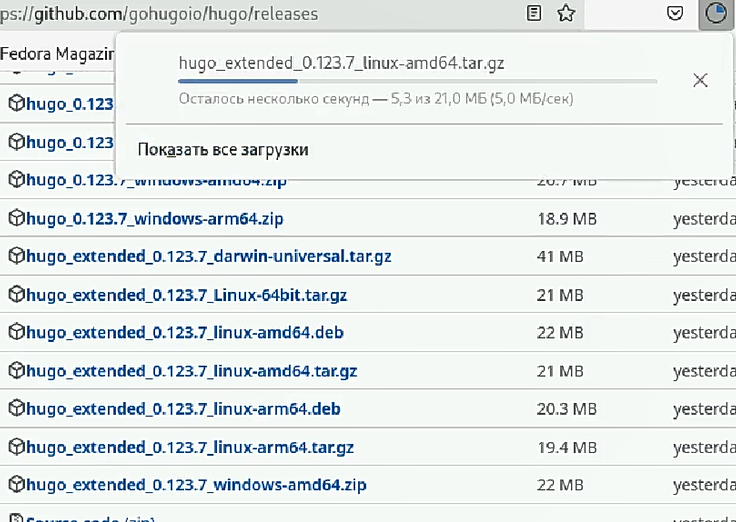{width=95%}

## Распаковка ПО

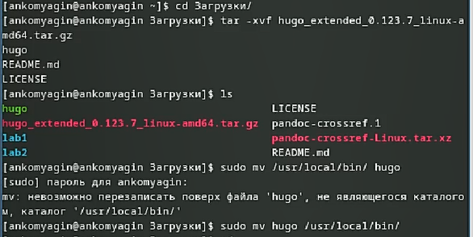{width=95%}

## Создание репозитория 

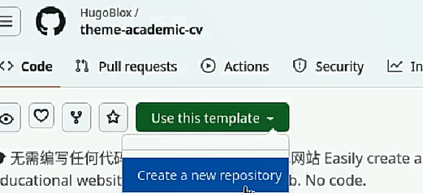{width=95%} 

## Загрузка репозитория

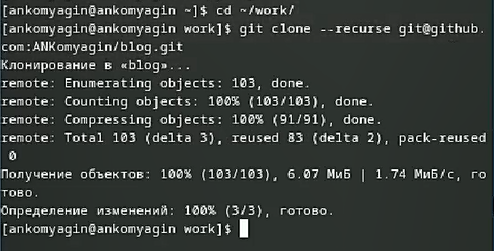{width=95%}

## Запуск hugo

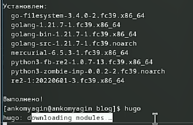{width=95%}

## Запуск hugo server локальный сайт

{width=95%}

## Создание специального репозитория

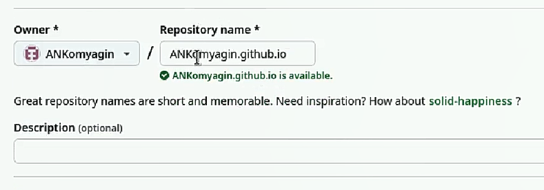{width=95%}

## Клонирование репозитория

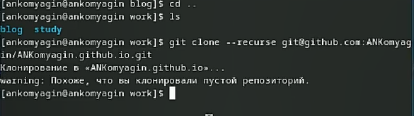{width=95%}

## Добавление файла в репозиторий

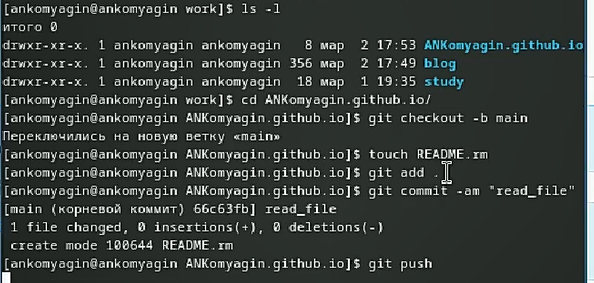{width=95%}

## Синхронизация public с репозиторием

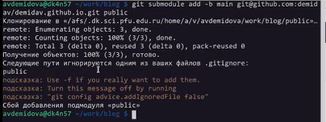{width=95%}

## Запускаем hugo и отправляем данные в репозиторий

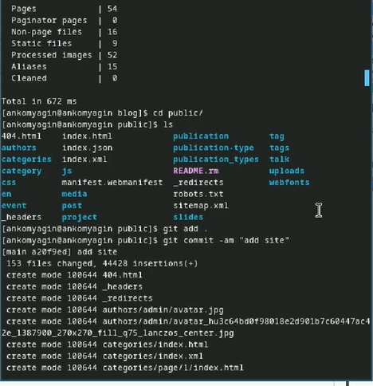{width=95%}

## Проверяем работу сайта

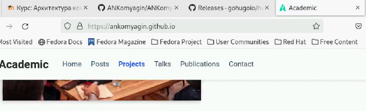{width=95%}

## Вывод

В ходе выполнения первого этапа проекта я научился работать с git ветками. Ознакомился с конструктором hugo 

