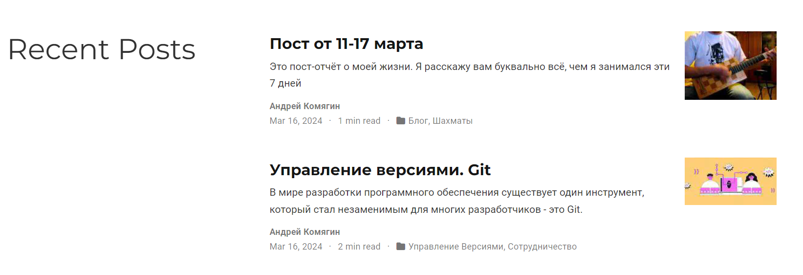
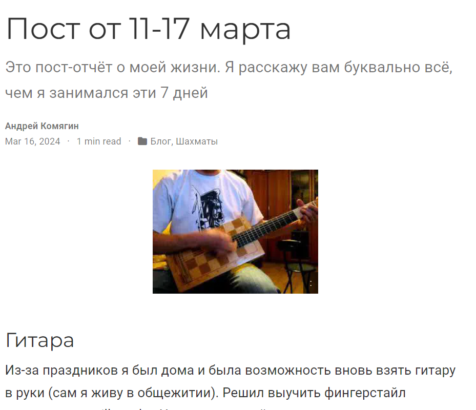
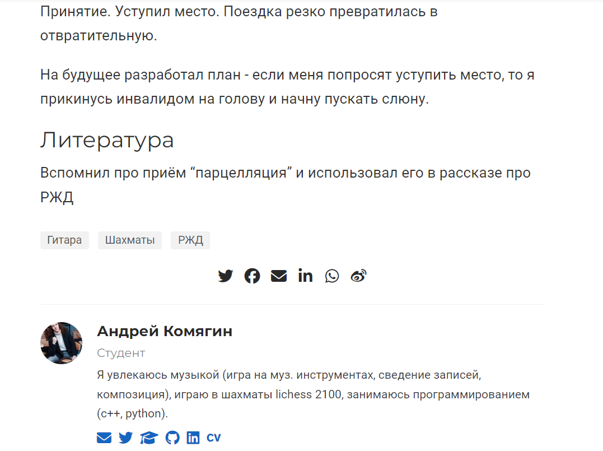
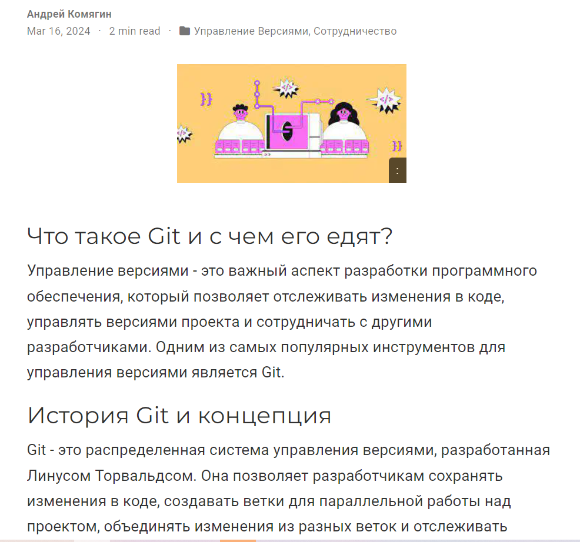

---
## Front matter
lang: ru-RU
title: Индивидуальный проект
subtitle: Этап 2
author:
  - Комягин А.Н.
institute:
  - Российский университет дружбы народов, Москва, Россия
date: 16 марта 2024

## i18n babel
babel-lang: russian
babel-otherlangs: english

## Formatting pdf
toc: false
toc-title: Содержание
slide_level: 2
aspectratio: 169
section-titles: true
theme: metropolis
header-includes:
 - \metroset{progressbar=frametitle,sectionpage=progressbar,numbering=fraction}
 - '\makeatletter'
 - '\beamer@ignorenonframefalse'
 - '\makeatother'

##Fonts
mainfont: PT Serif
romanfont: PT Serif
sansfont: PT Sans
monofont: PT Mono
mainfontoptions: Ligatures=TeX
romanfontoptions: Ligatures=TeX
sansfontoptions: Ligatures=TeX,Scale=MatchLowercase
monofontoptions: Scale=MatchLowercase,Scale=0.9
---

## Цель

Добавить к сайту данные о себе.

## Задание

* Разместить фотографию владельца сайта.

* Разместить краткое описание владельца сайта.

* Добавить информацию об интересах.

* Добавить информацию от образовании.

* Сделать пост по прошедшей неделе.

* Добавить пост на тему: управление версиями. Git.

# Результат работы на этапе 2

## Биография, аватарка, фамилия имя, место учёбы

{width=95%}

## Недавние посты

{width=95%}

## Недельный пост

{width=95%} 

## Подпись под постами

{width=95%}

## Пост про Git

{width=95%}

## Отправка на git

{width=95%}

## Вывод

В ходе выполнения первого этапа проекта я добавил данные о себе на сайт 

