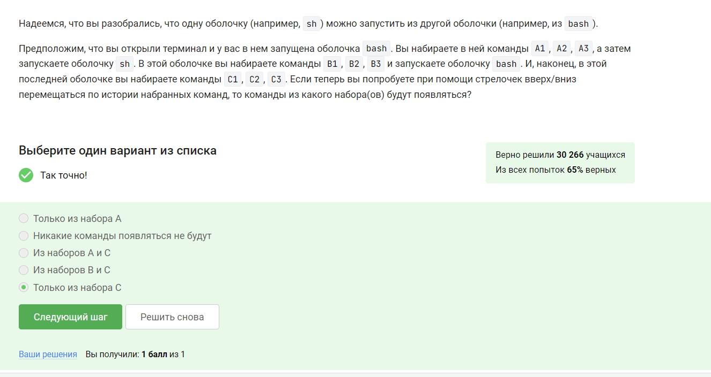

---
## Front matter
title: "Прохождение внешнего курса"
subtitle: "Продвинутые темы"
author: "Комягин Андрей Николаевич"

## Generic otions
lang: ru-RU
toc-title: "Содержание"

## Bibliography
bibliography: bib/cite.bib
csl: pandoc/csl/gost-r-7-0-5-2008-numeric.csl

## Pdf output format
toc: true # Table of contents
toc-depth: 2
lof: true # List of figures
lot: true # List of tables
fontsize: 12pt
linestretch: 1.5
papersize: a4
documentclass: scrreprt
## I18n polyglossia
polyglossia-lang:
  name: russian
  options:
	- spelling=modern
	- babelshorthands=true
polyglossia-otherlangs:
  name: english
## I18n babel
babel-lang: russian
babel-otherlangs: english
## Fonts
mainfont: PT Serif
romanfont: PT Serif
sansfont: PT Sans
monofont: PT Mono
mainfontoptions: Ligatures=TeX
romanfontoptions: Ligatures=TeX
sansfontoptions: Ligatures=TeX,Scale=MatchLowercase
monofontoptions: Scale=MatchLowercase,Scale=0.9
## Biblatex
biblatex: true
biblio-style: "gost-numeric"
biblatexoptions:
  - parentracker=true
  - backend=biber
  - hyperref=auto
  - language=auto
  - autolang=other*
  - citestyle=gost-numeric
## Pandoc-crossref LaTeX customization
figureTitle: "Рис."
tableTitle: "Таблица"
listingTitle: "Листинг"
lofTitle: "Список иллюстраций"
lotTitle: "Список таблиц"
lolTitle: "Листинги"
## Misc options
indent: true
header-includes:
  - \usepackage{indentfirst}
  - \usepackage{float} # keep figures where there are in the text
  - \floatplacement{figure}{H} # keep figures where there are in the text
---

# Цель прохождения курса

Познакомиться с текстовым редактором vim, языком bash. Научиться писать скрипты. Освоить продвинутый поиск, постройку графиков. Углубиться в управление разрешениями

# Выполнение заданий курса

## Общая информация о курсе

Информация об этом дана в видеоролике(рис. [-@fig:001]).

{#fig:001 width=70%}

Решено путем практического эксперимента(рис. [-@fig:002]).

{#fig:002 width=70%}

Решено путем практического эксперимента(рис. [-@fig:003]).

{#fig:003 width=70%}

Используем %s для замены всех слов Windows на Linux(рис. [-@fig:004]).

{#fig:004 width=70%}

Ответил на вопрос, потому что попробовал данный режим(рис. [-@fig:005]).

{#fig:005 width=70%}

Передвижение будет внутри последней оболочки(рис. [-@fig:006]).

{#fig:006 width=70%}

Переход в директорию первой командой cd и создание там файла. Последующий переход роли не играет(рис. [-@fig:007]).

{#fig:007 width=70%}

Переменная не должна начинаться с цифры, не должна иметь символов кроме нижнего подчеркивания(рис. [-@fig:008]).

{#fig:008 width=70%}

Просто смотрим выражения и значения ключей. Можно проверить практической работой программы(рис. [-@fig:009]).

{#fig:009 width=70%}

3 и 5 не подходят под условия "больше 5", "меньше 3" или "равно 4", поэтому попадают на ветку else(рис. [-@fig:010]).

{#fig:010 width=70%}

Простенькая программа с ветвлением. Для людей, умеющий программировать на других ЯП, проблем позникнуть не должно(рис. [-@fig:011]).

{#fig:011 width=70%}

Важное примечание: запятые также являются символами. Разделителем является только пробел(рис. [-@fig:012]).

{#fig:012 width=70%}

Простейшее ветвление, обернутое в цикл while (рис. [-@fig:013]).

{#fig:013 width=70%}

Код целиком(рис. [-@fig:014]).

{#fig:014 width=70%}

Для обозначения арифметической операции используется let. Выражение должно быть обёрнуто кавычками или написано без пробелов(рис. [-@fig:015]).

{#fig:015 width=70%}

Просто перемещаемся в директорию с помощью cd и выводим путь в текущую директорию(рис. [-@fig:016]).

{#fig:016 width=70%}

Выполнено наполовину методом "научного тыка"(рис. [-@fig:017]).

{#fig:017 width=70%}

Важно обратить на область определения переменных в функциях(рис. [-@fig:018]).

{#fig:018 width=70%}

Алгоритм дан, но я использовал вместо вычитания остаток от деления. Тоже работает (даже эффективнее)(рис. [-@fig:019]).

{#fig:019 width=70%}

Написать калькулятор...(рис. [-@fig:020]).

{#fig:020 width=70%}

Разница команд в учете и НЕ учете регистра при поиске(рис. [-@fig:021]).

{#fig:021 width=70%}

Проще воспользоваться методом исключения. Команды точно не работают одинаково и точно их результат не остается неизменным. Опции path и name используются не только для директорий и файлов соответственно(рис. [-@fig:022]).

{#fig:022 width=70%}

Минимальная глубина 2, максимальная 3. Вывод напрашивается сам(рис. [-@fig:023]).

{#fig:023 width=70%}

В данной ситуации опции не изменят размер файла относительно друг друга(рис. [-@fig:024]).

{#fig:024 width=70%}

Проверил на практике. Результат удивил(рис. [-@fig:025]).

{#fig:025 width=70%}

Изучение документации снимает эту проблему(рис. [-@fig:026]).

{#fig:026 width=70%}

Крайне очевидно(рис. [-@fig:027]).

{#fig:027 width=70%}

Необходимо установить права доступа 764. Перечислены все варианты. Сложность вызвал факт, что нельзя просто указать права доступа используя символы **rwx-**(рис. [-@fig:028]).

{#fig:028 width=70%}

Внимательно смотрим на примечание и права доступа(рис. [-@fig:029]).

{#fig:029 width=70%}

Сложностью является размер слов в байтах. Ведь в документации написано, что даётся размер строки(рис. [-@fig:030]).

{#fig:030 width=70%}

Посмотреть опции из видеоролика(рис. [-@fig:031]).

{#fig:031 width=70%}

Использовать знание команд на максимум(рис. [-@fig:032]).

{#fig:032 width=70%}

# Вывод

В ходе выполнения лабораторной работы я рассмотрел продвинутые темы

