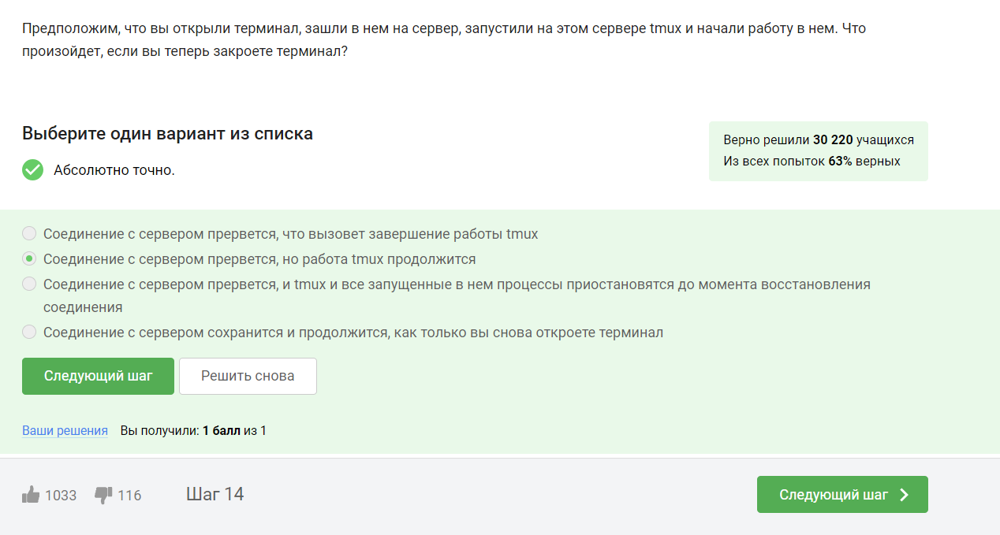

---
## Front matter
title: "Прохождение внешнего курса"
subtitle: "Работа с сервером"
author: "Комягин Андрей Николаевич"

## Generic otions
lang: ru-RU
toc-title: "Содержание"

## Bibliography
bibliography: bib/cite.bib
csl: pandoc/csl/gost-r-7-0-5-2008-numeric.csl

## Pdf output format
toc: true # Table of contents
toc-depth: 2
lof: true # List of figures
lot: true # List of tables
fontsize: 12pt
linestretch: 1.5
papersize: a4
documentclass: scrreprt
## I18n polyglossia
polyglossia-lang:
  name: russian
  options:
	- spelling=modern
	- babelshorthands=true
polyglossia-otherlangs:
  name: english
## I18n babel
babel-lang: russian
babel-otherlangs: english
## Fonts
mainfont: PT Serif
romanfont: PT Serif
sansfont: PT Sans
monofont: PT Mono
mainfontoptions: Ligatures=TeX
romanfontoptions: Ligatures=TeX
sansfontoptions: Ligatures=TeX,Scale=MatchLowercase
monofontoptions: Scale=MatchLowercase,Scale=0.9
## Biblatex
biblatex: true
biblio-style: "gost-numeric"
biblatexoptions:
  - parentracker=true
  - backend=biber
  - hyperref=auto
  - language=auto
  - autolang=other*
  - citestyle=gost-numeric
## Pandoc-crossref LaTeX customization
figureTitle: "Рис."
tableTitle: "Таблица"
listingTitle: "Листинг"
lofTitle: "Список иллюстраций"
lotTitle: "Список таблиц"
lolTitle: "Листинги"
## Misc options
indent: true
header-includes:
  - \usepackage{indentfirst}
  - \usepackage{float} # keep figures where there are in the text
  - \floatplacement{figure}{H} # keep figures where there are in the text
---

# Цель прохождения курса

Познакомиться с сервером, научиться обмениваться файлами, запускать и контролировать программы на сервере. Узнать про многопоточные приложения научиться использовать менеджер tmux.

# Выполнение заданий курса

## Общая информация о курсе

Удаленный сервер имеет очень много применений(рис. [-@fig:001]).

{#fig:001 width=70%}

Публичный ключ как раз и создан для передачи. Частный ключ необходимо держать в секрете(рис. [-@fig:002]).

{#fig:002 width=70%}

Для копирования папки необходима опция рекурсивного копирования -р(рис. [-@fig:003]).

{#fig:003 width=70%}

Иногда действительно может помочь обновление программы(рис. [-@fig:004]).

{#fig:004 width=70%}

Filezilla предназначена для пересылки и просмотра файлов, открывать программы она не умеет(рис. [-@fig:005]).

{#fig:005 width=70%}

Запустить команду на компьютере можно, но тогда она не запустится на сервере. Ответ на вопрос был дан в видео(рис. [-@fig:006]).

{#fig:006 width=70%}

Удивило, что вариант help programm является корректным(рис. [-@fig:007]).

{#fig:007 width=70%}

Просто смотрим документацию(рис. [-@fig:008]).

{#fig:008 width=70%}

Pаботу рrogramm1 мы завершили комбинацией ctrl+c (рис. [-@fig:009]).

{#fig:009 width=70%}

jobs имеет данный идентификатор только с использованием специального ключа. По умолчанию он использует упрощенные числа-идентификаторы(рис. [-@fig:010]).

{#fig:010 width=70%}

Опция -9 грубо выключает программу(рис. [-@fig:011]).

{#fig:011 width=70%}

Так как не использована опция -9, процесс завершится, после того, как будет продолжен(рис. [-@fig:012]).

{#fig:012 width=70%}

Остановленное приложение не использует ресурсы процессора(рис. [-@fig:013]).

{#fig:013 width=70%}

Остановленное приложение не пропадает из памяти(рис. [-@fig:014]).

{#fig:014 width=70%}

На то оно и многопоточное. Можно отключить только всё приложение сразу(рис. [-@fig:015]).

{#fig:015 width=70%}

Изучил информацию о подпрограммах(рис. [-@fig:016]).

{#fig:016 width=70%}

Во вкладках терминала команды выполняются независимо(рис. [-@fig:017]).

{#fig:017 width=70%}

Без вкладок tmux отключается(рис. [-@fig:018]).

{#fig:018 width=70%}

Основная "фишка" tmux как раз и заключается в его способности сохранить работу на сервере, в случае отключения клиента(рис. [-@fig:019]).

{#fig:019 width=70%}

При принудительном выключении всё закрывается(рис. [-@fig:020]).

{#fig:020 width=70%}

Изучил справку (с помощью grep)(рис. [-@fig:021]).

{#fig:021 width=70%}

Решил с помощью проверки в tmux(рис. [-@fig:023]).

{#fig:022 width=70%}

# Выводы

В ходе прохождения курса я освоил работу с файлами на сервере. Практиковал работу с tmux. Научился запускать приложения на сервере и контролировать их работу. Разобрался с многопоточными программами.

